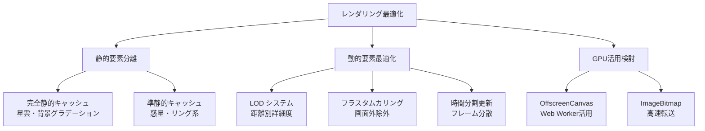
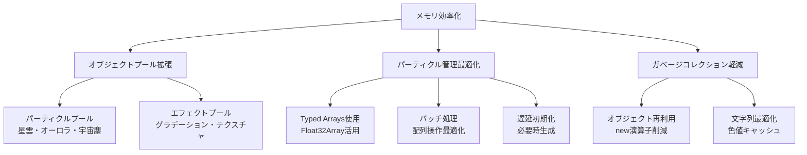
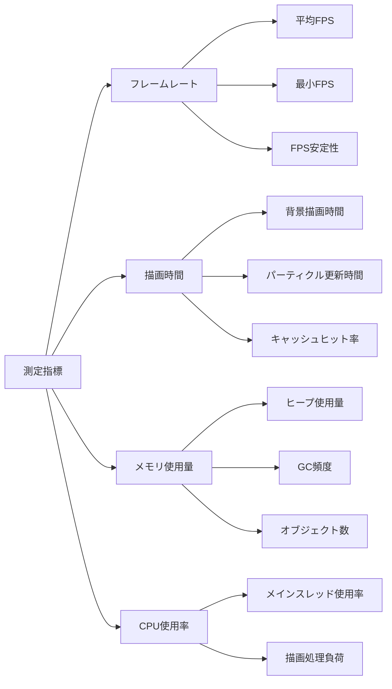

# 🚀 スペースシューター背景描画パフォーマンス改善計画

## 📋 プロジェクト概要

**作成日**: 2025年6月11日  
**対象**: スペースシューターゲーム背景描画システム  
**目標**: 60FPS安定達成、メモリ使用量削減、描画品質維持  

## 📊 現状分析

### 実装状況
- **BackgroundRenderer.ts**: 3層キャッシュシステム実装済み（背景、星雲、惑星）
- **複雑エンティティ**: Nebula（433行）、Aurora（410行）、Planet（461行）
- **大量パーティクル**: 星雲200個、オーロラ150個、宇宙塵120個
- **既存最適化**: レイヤー別キャッシング、パフォーマンス測定機能

### パフォーマンス課題
- 視覚的スムーズさの不足
- 複雑な描画処理による負荷
- 大量パーティクルの毎フレーム更新
- メモリ効率の改善余地

## 🎯 改善戦略

### 1. レンダリング最適化戦略



#### 1.1 静的要素と動的要素の完全分離
- **完全静的**: 星雲、背景グラデーション → 1回のみ描画
- **準静的**: 惑星（16フレーム間隔更新）→ 4フレーム間隔に短縮
- **動的**: 星、オーロラ、宇宙塵 → 最適化アルゴリズム適用

#### 1.2 LOD（Level of Detail）システム導入
- **距離ベース**: 画面中心からの距離で詳細度調整
- **パフォーマンスベース**: FPS監視による動的品質調整
- **3段階品質**: High（フル詳細）、Medium（50%パーティクル）、Low（25%パーティクル）

### 2. メモリ効率化戦略



#### 2.1 パーティクルプールシステム拡張
- **星雲パーティクル**: 200個 → プール管理
- **オーロラパーティクル**: 150個 → プール管理  
- **宇宙塵パーティクル**: 120個 → プール管理

#### 2.2 Typed Arrays活用
- パーティクル座標をFloat32Arrayで管理
- 色情報をUint8Arrayで効率化
- バッチ更新による処理高速化

### 3. 実装優先順位

```mermaid
gantt
    title パフォーマンス改善実装スケジュール
    dateFormat  X
    axisFormat %d

    section Phase 1: 基盤整備
    パフォーマンス測定強化     :p1, 0, 2
    LODシステム基盤           :p2, 1, 3
    
    section Phase 2: 高効果改善
    パーティクルプール拡張     :p3, 2, 4
    静的キャッシュ最適化       :p4, 3, 5
    
    section Phase 3: 高度最適化
    Typed Arrays導入         :p5, 4, 6
    時間分割更新システム       :p6, 5, 7
    
    section Phase 4: GPU活用
    OffscreenCanvas検討      :p7, 6, 8
    ImageBitmap実装         :p8, 7, 9
```



#### Phase 1: 基盤整備（効果: 中、リスク: 低）
1. **パフォーマンス測定システム強化**
   - FPS監視機能追加
   - メモリ使用量トラッキング
   - ボトルネック特定機能

2. **LODシステム基盤構築**
   - 品質レベル定義
   - 動的切り替え機構

#### Phase 2: 高効果改善（効果: 高、リスク: 低）
1. **パーティクルプールシステム拡張**
   - 既存ObjectPoolをパーティクル用に拡張
   - 星雲・オーロラ・宇宙塵パーティクル対応

2. **静的キャッシュ最適化**
   - 星雲の完全静的化
   - 背景グラデーションの事前計算最適化

#### Phase 3: 高度最適化（効果: 高、リスク: 中）
1. **Typed Arrays導入**
   - パーティクルデータ構造変更
   - バッチ処理システム構築

2. **時間分割更新システム**
   - フレーム分散更新アルゴリズム
   - 優先度ベース更新順序

#### Phase 4: GPU活用検討（効果: 高、リスク: 高）
1. **OffscreenCanvas + Web Worker**
   - バックグラウンド描画処理
   - メインスレッド負荷軽減

2. **ImageBitmap活用**
   - 高速画像転送
   - GPU最適化描画

### 4. パフォーマンス測定計画



#### 4.1 改善前後比較指標
- **フレームレート**: 平均・最小・安定性
- **描画時間**: 背景・パーティクル・総合
- **メモリ効率**: 使用量・GC頻度・リーク検出
- **CPU負荷**: メインスレッド・描画処理

#### 4.2 測定方法詳細化
- **リアルタイム監視**: Performance API活用
- **統計データ収集**: 移動平均・パーセンタイル
- **ベンチマークテスト**: 自動化テストスイート

## 🔧 技術実装詳細

### 新規クラス設計

```typescript
// パフォーマンス監視システム
class PerformanceMonitor {
  private fpsHistory: number[] = [];
  private memoryHistory: number[] = [];
  private renderTimeHistory: number[] = [];
  
  updateMetrics(): PerformanceMetrics;
  getRecommendedLOD(): LODLevel;
  getAverageFrameTime(): number;
  getMemoryUsage(): number;
}

// LODシステム
enum LODLevel {
  HIGH = 'high',
  MEDIUM = 'medium', 
  LOW = 'low'
}

class LODManager {
  private currentLevel: LODLevel = LODLevel.HIGH;
  private performanceThresholds = {
    high: { minFPS: 55, maxMemory: 50 },
    medium: { minFPS: 45, maxMemory: 75 },
    low: { minFPS: 30, maxMemory: 100 }
  };
  
  updateLOD(performanceMetrics: PerformanceMetrics): void;
  getParticleCount(baseCount: number): number;
  getCurrentLevel(): LODLevel;
}

// 拡張パーティクルプール
interface ParticlePoolConfig {
  initialSize: number;
  maxSize: number;
  resetFn?: (particle: any) => void;
}

class ParticlePoolManager extends PoolManager {
  private particlePools: Map<string, ObjectPool<any>>;
  
  registerParticlePool<T>(type: string, config: ParticlePoolConfig, createFn: () => T): void;
  getParticle<T>(type: string): T;
  releaseParticle<T>(type: string, particle: T): void;
  getPoolStats(): { [key: string]: { active: number; pooled: number } };
}

// Typed Array パーティクルシステム
class TypedParticleSystem {
  private positions: Float32Array;
  private velocities: Float32Array;
  private colors: Uint8Array;
  private lifetimes: Float32Array;
  
  updateBatch(deltaTime: number): void;
  renderBatch(ctx: CanvasRenderingContext2D): void;
}
```

### 既存クラス拡張

```typescript
// BackgroundRenderer拡張
class BackgroundRenderer {
  private lodManager: LODManager;
  private performanceMonitor: PerformanceMonitor;
  private particlePoolManager: ParticlePoolManager;
  private typedParticleSystem: TypedParticleSystem;
  
  // 新機能
  drawOptimizedBackgroundWithLOD(
    ctx: CanvasRenderingContext2D,
    stars: Star[],
    planets: Planet[],
    nebulas: Nebula[],
    auroras: Aurora[],
    comets: Comet[],
    meteorShowers: MeteorShower[],
    spaceDusts: SpaceDust[]
  ): void;
  
  updatePerformanceBasedSettings(): void;
  getDetailedPerformanceStats(): DetailedPerformanceStats;
  
  // 時間分割更新
  private updateQueue: Array<() => void> = [];
  private currentUpdateIndex = 0;
  
  scheduleUpdate(updateFn: () => void): void;
  processScheduledUpdates(maxTimeSlice: number): void;
}

// GameObjectManager拡張
class GameObjectManager {
  private particlePoolManager: ParticlePoolManager;
  
  // パーティクル効率化
  updateBackgroundObjectsWithLOD(deltaTime: number, lodLevel: LODLevel): void;
  cullOffscreenParticles(): void;
}
```

## 📈 期待される改善効果

### 定量的目標
- **フレームレート**: 安定60FPS達成
- **描画時間**: 30%削減（16.67ms → 11.67ms）
- **メモリ使用量**: 25%削減
- **GC頻度**: 50%削減

### 定性的改善
- **視覚的スムーズさ**: 大幅改善
- **レスポンシブネス**: 向上
- **安定性**: 長時間プレイでの性能維持
- **拡張性**: 新エフェクト追加時の性能影響最小化

## ⚠️ リスク評価と対策

### 高リスク項目
1. **GPU活用機能**: ブラウザ互換性問題
   - **対策**: フォールバック機構実装、段階的導入
2. **Typed Arrays導入**: 既存コード大幅変更
   - **対策**: 段階的移行、十分なテスト、ロールバック計画

### 中リスク項目
1. **LODシステム**: 品質低下の可能性
   - **対策**: 細かい品質調整、ユーザー設定提供
2. **時間分割更新**: 複雑性増加
   - **対策**: 詳細設計、単体テスト充実

### 低リスク項目
1. **パフォーマンス測定強化**: 既存システム拡張
   - **対策**: 段階的機能追加
2. **パーティクルプール拡張**: 既存パターン適用
   - **対策**: 既存ObjectPoolの知見活用

---

# ✅ 実装チェックリスト

## Phase 1: 基盤整備

### パフォーマンス測定システム強化
- [ ] **PerformanceMonitorクラス作成**
  - [ ] FPS測定機能実装
  - [ ] メモリ使用量トラッキング
  - [ ] 描画時間測定
  - [ ] 統計データ収集機能
- [ ] **測定データ可視化**
  - [ ] リアルタイム表示機能
  - [ ] 履歴グラフ表示
  - [ ] パフォーマンス警告システム
- [ ] **ベンチマークテスト作成**
  - [ ] 自動化テストスイート
  - [ ] 回帰テスト機能
  - [ ] パフォーマンス比較レポート

### LODシステム基盤構築
- [ ] **LODManagerクラス作成**
  - [ ] 品質レベル定義（HIGH/MEDIUM/LOW）
  - [ ] 動的切り替えロジック
  - [ ] パフォーマンス閾値設定
- [ ] **LOD適用機能**
  - [ ] パーティクル数調整
  - [ ] 描画品質調整
  - [ ] 更新頻度調整
- [ ] **テスト実装**
  - [ ] LOD切り替えテスト
  - [ ] パフォーマンス影響測定
  - [ ] 品質劣化確認

## Phase 2: 高効果改善

### パーティクルプールシステム拡張
- [ ] **ParticlePoolManagerクラス作成**
  - [ ] 既存ObjectPool拡張
  - [ ] 型別プール管理
  - [ ] 統計情報収集
- [ ] **パーティクル別プール実装**
  - [ ] 星雲パーティクルプール（200個対応）
  - [ ] オーロラパーティクルプール（150個対応）
  - [ ] 宇宙塵パーティクルプール（120個対応）
- [ ] **既存コード統合**
  - [ ] Nebulaクラス修正
  - [ ] Auroraクラス修正
  - [ ] SpaceDustクラス修正
- [ ] **メモリ効率測定**
  - [ ] GC頻度測定
  - [ ] メモリ使用量比較
  - [ ] オブジェクト生成数追跡

### 静的キャッシュ最適化
- [ ] **星雲完全静的化**
  - [ ] 星雲描画の1回限り実行
  - [ ] キャッシュ無効化条件見直し
  - [ ] 描画品質維持確認
- [ ] **背景グラデーション最適化**
  - [ ] 事前計算処理改善
  - [ ] キャッシュサイズ最適化
  - [ ] 描画パフォーマンス測定
- [ ] **キャッシュ管理改善**
  - [ ] メモリ使用量監視
  - [ ] キャッシュヒット率測定
  - [ ] 自動クリーンアップ機能

## Phase 3: 高度最適化

### Typed Arrays導入
- [ ] **TypedParticleSystemクラス作成**
  - [ ] Float32Array座標管理
  - [ ] Uint8Array色情報管理
  - [ ] バッチ更新処理
- [ ] **既存パーティクルシステム移行**
  - [ ] 段階的移行計画
  - [ ] データ構造変更
  - [ ] 互換性維持
- [ ] **パフォーマンス測定**
  - [ ] 更新処理速度比較
  - [ ] メモリ使用量比較
  - [ ] 描画性能測定
- [ ] **テスト充実**
  - [ ] 機能回帰テスト
  - [ ] パフォーマンステスト
  - [ ] エラーハンドリング

### 時間分割更新システム
- [ ] **更新スケジューラー実装**
  - [ ] 更新キュー管理
  - [ ] 時間スライス制御
  - [ ] 優先度ベース処理
- [ ] **フレーム分散アルゴリズム**
  - [ ] 負荷分散ロジック
  - [ ] 動的優先度調整
  - [ ] パフォーマンス監視連携
- [ ] **既存更新処理統合**
  - [ ] BackgroundRenderer統合
  - [ ] GameObjectManager統合
  - [ ] 更新順序最適化

## Phase 4: GPU活用検討

### OffscreenCanvas + Web Worker
- [ ] **Web Worker実装**
  - [ ] バックグラウンド描画処理
  - [ ] メインスレッド通信
  - [ ] エラーハンドリング
- [ ] **OffscreenCanvas統合**
  - [ ] 描画処理移行
  - [ ] 結果転送最適化
  - [ ] フォールバック機構
- [ ] **ブラウザ互換性対応**
  - [ ] 機能検出
  - [ ] 段階的フォールバック
  - [ ] パフォーマンス比較

### ImageBitmap活用
- [ ] **ImageBitmap描画システム**
  - [ ] 高速画像転送
  - [ ] GPU最適化描画
  - [ ] キャッシュ統合
- [ ] **既存描画システム統合**
  - [ ] 段階的移行
  - [ ] 品質維持確認
  - [ ] パフォーマンス測定

## 品質保証・テスト

### 単体テスト
- [ ] **新規クラステスト**
  - [ ] PerformanceMonitor
  - [ ] LODManager
  - [ ] ParticlePoolManager
  - [ ] TypedParticleSystem
- [ ] **既存クラス拡張テスト**
  - [ ] BackgroundRenderer拡張機能
  - [ ] GameObjectManager拡張機能

### 統合テスト
- [ ] **パフォーマンステスト**
  - [ ] フレームレート測定
  - [ ] メモリ使用量測定
  - [ ] CPU負荷測定
- [ ] **品質テスト**
  - [ ] 描画品質確認
  - [ ] 視覚的回帰テスト
  - [ ] ユーザビリティテスト

### パフォーマンス検証
- [ ] **ベンチマーク実行**
  - [ ] 改善前後比較
  - [ ] 目標値達成確認
  - [ ] 長時間安定性テスト
- [ ] **最適化効果測定**
  - [ ] FPS安定性確認
  - [ ] メモリリーク検証
  - [ ] CPU使用率改善確認

## ドキュメント・保守

### 技術ドキュメント
- [ ] **API ドキュメント更新**
  - [ ] 新規クラス・メソッド
  - [ ] 既存機能変更点
  - [ ] 使用例・サンプルコード
- [ ] **アーキテクチャドキュメント**
  - [ ] システム構成図更新
  - [ ] データフロー図
  - [ ] パフォーマンス特性

### 運用・保守
- [ ] **監視・アラート設定**
  - [ ] パフォーマンス監視
  - [ ] エラー監視
  - [ ] 品質劣化検出
- [ ] **保守手順書作成**
  - [ ] トラブルシューティング
  - [ ] パフォーマンスチューニング
  - [ ] 設定変更手順

---

## 📝 実装ノート

### 重要な考慮事項
1. **段階的実装**: 各フェーズを完了してから次に進む
2. **パフォーマンス測定**: 各変更後に必ず効果を測定
3. **品質維持**: 最適化により描画品質が劣化しないよう注意
4. **互換性**: 既存機能との互換性を維持
5. **テスト充実**: 回帰テストとパフォーマンステストを重視

### 成功指標
- **フレームレート**: 安定60FPS達成
- **描画時間**: 30%以上削減
- **メモリ使用量**: 25%以上削減
- **ユーザー体験**: 視覚的スムーズさの大幅改善

この計画書と実装チェックリストを参考に、段階的かつ確実にパフォーマンス改善を進めてください。