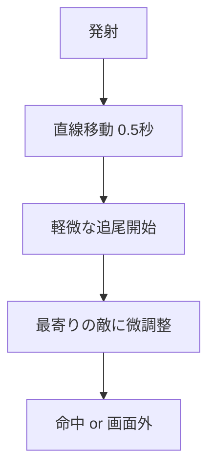
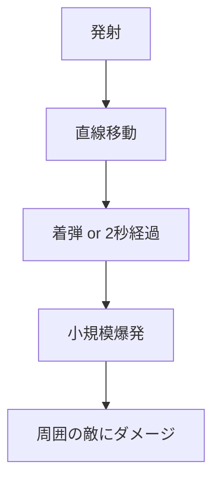
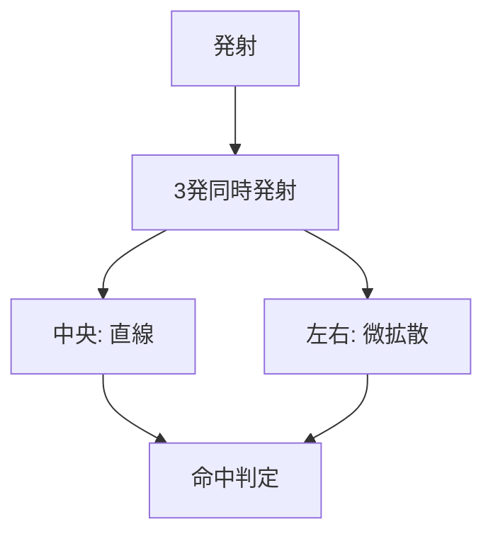
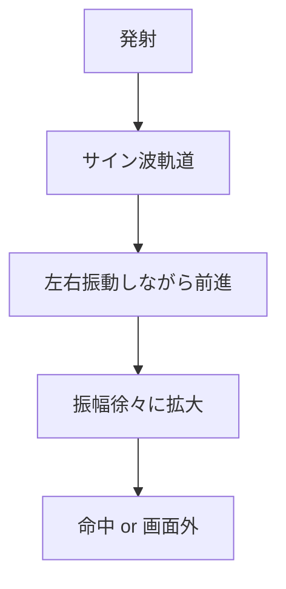

# 基本武器弾道パターン改善設計書

## 📋 概要

### プロジェクト目標
基本武器（ベーシックレーザー、プラズマキャノン、速射砲、エネルギービーム）に独自の弾道パターンを追加し、各武器に明確な戦略的価値と個性を与える。

### 設計方針
**戦略的価値の差別化**を重視し、各武器に以下の戦術的役割を付与：
- **精密狙撃** - 確実な命中
- **広範囲制圧** - 複数敵への同時攻撃
- **弾幕制圧** - 広範囲カバー
- **回避困難** - 予測困難な軌道

## 🎯 現状分析と問題点

### 現在の基本武器仕様
| 武器 | ダメージ | 発射間隔 | 弾速 | 問題点 |
|------|----------|----------|------|--------|
| ベーシックレーザー | 1 | 200ms | 600 | 直線軌道のみ |
| プラズマキャノン | 2 | 300ms | 500 | 直線軌道のみ |
| 速射砲 | 1 | 100ms | 650 | 直線軌道のみ |
| エネルギービーム | 1 | 150ms | 700 | 直線軌道のみ |

### 主要課題
1. 全武器が同じ直線軌道で差別化不足
2. 戦術的価値の違いが不明確
3. プレイヤーが武器の個性を感じられない

## 🚀 新弾道パターン設計

### 1. ベーシックレーザー - 精密狙撃型



**戦術的価値**: 初心者向けの確実な命中
- **弾道**: 発射後0.5秒は直線、その後軽微な追尾効果
- **追尾範囲**: 30度以内の敵のみ
- **追尾強度**: 弱（ゆるやかな軌道修正）
- **新ダメージ**: 1.2（確実命中でDPS向上）

### 2. プラズマキャノン - 広範囲制圧型



**戦術的価値**: 密集した敵群への効果的攻撃
- **弾道**: 直線移動だが着弾時に小爆発
- **爆発範囲**: 半径25px
- **爆発ダメージ**: メインダメージの50%
- **新ダメージ**: 1.8 + 爆発0.9（総2.7で群攻撃）

### 3. 速射砲 - 弾幕制圧型



**戦術的価値**: 広い範囲をカバーする弾幕
- **弾道**: 3発同時発射（中央1発 + 左右各1発）
- **拡散角度**: ±15度
- **個別ダメージ**: 0.7（合計2.1で現在より強化）

### 4. エネルギービーム - 回避困難型



**戦術的価値**: 予測困難な軌道で回避を困難にする
- **弾道**: サイン波状の蛇行軌道
- **振動周期**: 0.8秒
- **最大振幅**: ±40px
- **新ダメージ**: 1.1（回避困難性で価値向上）

## 🏗️ 技術実装アーキテクチャ

### 基底インターフェース設計

```typescript
// src/weapons/types/TrajectoryTypes.ts
export interface IBulletTrajectory {
  update(bullet: Bullet, deltaTime: number): void;
  isComplete(): boolean;
  reset(): void;
  getType(): TrajectoryType;
  getDebugInfo(): TrajectoryDebugInfo;
}

export enum TrajectoryType {
  PRECISION = 'precision',
  AREA_EFFECT = 'area_effect', 
  BARRAGE = 'barrage',
  EVASIVE = 'evasive',
  STRAIGHT = 'straight'
}
```

### 弾道パターンクラス階層

```typescript
// 基底抽象クラス
export abstract class BaseTrajectory implements IBulletTrajectory {
  protected startTime: number = 0;
  protected isCompleted: boolean = false;
  protected config: TrajectoryConfig;
  
  public abstract update(bullet: Bullet, deltaTime: number): void;
  public abstract getType(): TrajectoryType;
  
  protected getElapsedTime(): number {
    return Date.now() - this.startTime;
  }
}

// 具体実装クラス
export class PrecisionTrajectory extends BaseTrajectory { /* 精密射撃 */ }
export class AreaEffectTrajectory extends BaseTrajectory { /* 範囲攻撃 */ }
export class BarrageTrajectory extends BaseTrajectory { /* 弾幕攻撃 */ }
export class EvasiveTrajectory extends BaseTrajectory { /* 回避困難 */ }
```

### TrajectoryFactory（オブジェクトプール対応）

```typescript
export class TrajectoryFactory {
  private static trajectoryPools: Map<TrajectoryType, IBulletTrajectory[]> = new Map();
  
  public static createTrajectory(
    type: TrajectoryType, 
    config: TrajectoryConfig,
    bulletIndex?: number
  ): IBulletTrajectory {
    const pooled = this.getFromPool(type);
    if (pooled) {
      pooled.reset();
      return pooled;
    }
    
    switch (type) {
      case TrajectoryType.PRECISION:
        return new PrecisionTrajectory(config);
      case TrajectoryType.AREA_EFFECT:
        return new AreaEffectTrajectory(config);
      case TrajectoryType.BARRAGE:
        return new BarrageTrajectory(config, bulletIndex);
      case TrajectoryType.EVASIVE:
        return new EvasiveTrajectory(config);
    }
  }
  
  public static returnToPool(trajectory: IBulletTrajectory): void {
    // プールに返却
  }
}
```

## 🔧 既存システム統合

### Bulletクラス拡張

```typescript
export class Bullet extends GameObject {
  private trajectory?: IBulletTrajectory;
  
  public setTrajectory(trajectory: IBulletTrajectory): void {
    if (this.trajectory) {
      TrajectoryFactory.returnToPool(this.trajectory);
    }
    this.trajectory = trajectory;
  }
  
  public update(deltaTime: number): void {
    if (this.trajectory && !this.trajectory.isComplete()) {
      this.trajectory.update(this, deltaTime);
      
      if (this.trajectory.isComplete()) {
        TrajectoryFactory.returnToPool(this.trajectory);
        this.trajectory = undefined;
      }
    } else {
      // 従来の直線移動（後方互換性）
      this.y -= this.speed * deltaTime;
    }
    
    // 既存の更新処理...
  }
}
```

### WeaponBulletFactory統合

```typescript
export class WeaponBulletFactory implements IWeaponBulletFactory {
  private trajectoryConfigs: Map<WeaponType, TrajectoryConfig> = new Map();
  
  constructor() {
    this.initializeTrajectoryConfigs();
  }
  
  private initializeTrajectoryConfigs(): void {
    // ベーシックレーザー：精密射撃
    this.trajectoryConfigs.set(WeaponType.BASIC_LASER, {
      type: TrajectoryType.PRECISION,
      parameters: {
        speed: 600,
        straightPhaseDuration: 500,
        trackingStrength: 0.002,
        trackingRange: Math.PI / 6
      }
    });
    
    // プラズマキャノン：範囲攻撃
    this.trajectoryConfigs.set(WeaponType.PLASMA_CANNON, {
      type: TrajectoryType.AREA_EFFECT,
      parameters: {
        speed: 500,
        explosionDelay: 2000,
        explosionRadius: 25,
        explosionDamage: 0.9
      }
    });
    
    // 速射砲：弾幕攻撃
    this.trajectoryConfigs.set(WeaponType.RAPID_FIRE, {
      type: TrajectoryType.BARRAGE,
      parameters: {
        speed: 650,
        spreadAngle: Math.PI / 12,
        bulletCount: 3
      }
    });
    
    // エネルギービーム：回避困難
    this.trajectoryConfigs.set(WeaponType.ENERGY_BEAM, {
      type: TrajectoryType.EVASIVE,
      parameters: {
        speed: 700,
        wavePeriod: 800,
        maxAmplitude: 40,
        amplitudeGrowthRate: 0.05
      }
    });
  }
  
  public createBasicBullet(
    weaponConfig: WeaponConfig,
    position: Vector2D,
    direction: Vector2D
  ): Bullet {
    const bullet = this.getBulletFromPool(weaponConfig.id) ?? new Bullet();
    
    bullet.initialize(position.x, position.y, weaponConfig.bulletSpeed, 
                     this.getWeaponColor(weaponConfig), 'player');
    
    // 弾道パターンを設定
    this.applyTrajectoryPattern(bullet, weaponConfig);
    
    return bullet;
  }
  
  private applyTrajectoryPattern(bullet: Bullet, weaponConfig: WeaponConfig): void {
    const trajectoryConfig = this.trajectoryConfigs.get(weaponConfig.type);
    
    if (trajectoryConfig) {
      const trajectory = TrajectoryFactory.createTrajectory(
        trajectoryConfig.type,
        trajectoryConfig
      );
      bullet.setTrajectory(trajectory);
    }
  }
}
```

## 🎨 ビジュアル表現強化

### 弾道パターン別ビジュアル設定

```typescript
const TRAJECTORY_VISUAL_CONFIGS = {
  precision: {
    trail: { enabled: true, color: '#00aaff', length: 15 },
    effects: [{ type: 'targeting_line', intensity: 0.3 }]
  },
  areaEffect: {
    trail: { enabled: true, color: '#ff6600', length: 20 },
    effects: [{ type: 'charge_buildup', intensity: 0.8 }]
  },
  barrage: {
    trail: { enabled: true, color: '#ffaa00', length: 10 },
    effects: [{ type: 'rapid_fire_sparks', intensity: 0.6 }]
  },
  evasive: {
    trail: { enabled: true, color: '#aa00ff', length: 25 },
    effects: [{ type: 'wave_distortion', intensity: 0.7 }]
  }
};
```

### 新ビジュアルエフェクト

1. **ターゲティングライン** - 精密射撃の予告線
2. **チャージビルドアップ** - 爆発前の蓄積エフェクト
3. **ラピッドファイアスパーク** - 高速連射の火花
4. **ウェーブディストーション** - 波状軌道の歪み効果

## ⚖️ バランス調整

### 戦術的価値に基づく新バランス

| 武器 | 現在ダメージ | 新ダメージ | 特殊効果 | 戦術的役割 |
|------|-------------|-----------|----------|------------|
| ベーシックレーザー | 1.0 | 1.2 | 軽微追尾 | 確実命中 |
| プラズマキャノン | 2.0 | 1.8 + 爆発0.9 | 範囲爆発 | 群攻撃 |
| 速射砲 | 1.0 | 0.7×3発 | 3発同時 | 制圧力 |
| エネルギービーム | 1.0 | 1.1 | 蛇行軌道 | 回避困難 |

### 使用場面の差別化

- **単体ボス戦**: ベーシックレーザー（確実命中）
- **雑魚敵群戦**: プラズマキャノン（範囲攻撃）
- **密集地帯**: 速射砲（弾幕制圧）
- **機動力高い敵**: エネルギービーム（回避困難）

## 📊 実装フェーズ

### Phase 1: 弾道システム基盤（1-2週間）
- [ ] `IBulletTrajectory`インターフェース実装
- [ ] `BaseTrajectory`抽象クラス作成
- [ ] `TrajectoryFactory`実装
- [ ] 基本的な単体テスト

### Phase 2: 弾道パターン実装（2-3週間）
- [ ] `PrecisionTrajectory`実装（ベーシックレーザー）
- [ ] `AreaEffectTrajectory`実装（プラズマキャノン）
- [ ] `BarrageTrajectory`実装（速射砲）
- [ ] `EvasiveTrajectory`実装（エネルギービーム）
- [ ] 各弾道パターンの単体テスト

### Phase 3: システム統合（1-2週間）
- [ ] `Bullet`クラス拡張
- [ ] `WeaponBulletFactory`統合
- [ ] `WeaponManager`連携
- [ ] 統合テスト

### Phase 4: ビジュアル強化（1-2週間）
- [ ] 弾道パターン別ビジュアル設定
- [ ] `BulletVisualManager`連携
- [ ] 新エフェクト実装
- [ ] ビジュアルテスト

### Phase 5: バランス調整・最適化（1週間）
- [ ] ダメージ値調整
- [ ] パフォーマンス最適化
- [ ] プレイテスト
- [ ] 最終調整

## 🔧 技術的考慮事項

### パフォーマンス最適化
- **オブジェクトプール**: 弾道パターンの再利用
- **計算軽量化**: 複雑な数学計算の最適化
- **早期削除**: 画面外弾丸の即座な削除
- **LOD**: 距離に応じた計算精度調整

### 既存システムとの互換性
- **後方互換性**: 既存の直線弾道も維持
- **特殊武器**: 既存の特殊効果システムと共存
- **エンチャント**: エンチャントシステムとの連携
- **セーブデータ**: 既存セーブデータの互換性維持

### 拡張性
- **新弾道追加**: 新しい弾道パターンの容易な追加
- **パラメータ調整**: 設定ファイルでの動的調整
- **レベルアップ**: 武器レベルアップ時の弾道強化
- **組み合わせ**: 複数弾道パターンの組み合わせ

## 🧪 テスト戦略

### 単体テスト
- [ ] 各弾道パターンクラスの動作テスト
- [ ] TrajectoryFactoryのプール管理テスト
- [ ] Bulletクラスの弾道統合テスト

### 統合テスト
- [ ] WeaponBulletFactoryとの統合テスト
- [ ] ゲームエンジンでの動作テスト
- [ ] パフォーマンステスト

### ビジュアルテスト
- [ ] 各弾道パターンの視覚確認
- [ ] エフェクトの正常動作確認
- [ ] 異なる解像度での表示テスト

### ゲームプレイテスト
- [ ] 各武器の戦術的価値確認
- [ ] バランス調整の妥当性確認
- [ ] プレイヤー体験の向上確認

## 📈 成功指標

### 技術指標
- [ ] 弾道パターン実装完了率: 100%
- [ ] パフォーマンス劣化: 5%以内
- [ ] テストカバレッジ: 90%以上

### ゲームプレイ指標
- [ ] 武器使用率の均等化
- [ ] プレイヤー満足度向上
- [ ] 戦術的多様性の増加

## 🚀 今後の拡張可能性

### 追加弾道パターン
- **螺旋軌道**: 回転しながら前進
- **ブーメラン軌道**: 戻ってくる弾丸
- **重力軌道**: 重力の影響を受ける弾道
- **テレポート軌道**: 瞬間移動する弾丸

### 武器レベルアップ連携
- **弾道強化**: レベルアップで弾道パターンが強化
- **複合効果**: 高レベルで複数弾道パターンの組み合わせ
- **カスタマイズ**: プレイヤーが弾道パターンを選択

### エンチャントシステム連携
- **弾道エンチャント**: 弾道パターンを変更するエンチャント
- **効果増強**: 既存弾道パターンの効果を強化
- **新パターン**: エンチャントによる新しい弾道パターン

---

## 📝 実装チェックリスト

### 準備段階
- [ ] 設計書レビュー完了
- [ ] 技術仕様確定
- [ ] 開発環境準備

### 実装段階
- [ ] Phase 1: 基盤システム実装
- [ ] Phase 2: 弾道パターン実装
- [ ] Phase 3: システム統合
- [ ] Phase 4: ビジュアル強化
- [ ] Phase 5: 最終調整

### 完了段階
- [ ] 全テスト完了
- [ ] パフォーマンス確認
- [ ] ドキュメント更新
- [ ] リリース準備完了

---

**作成日**: 2025年6月23日  
**最終更新**: 2025年6月23日  
**バージョン**: 1.0  
**ステータス**: 実装準備完了