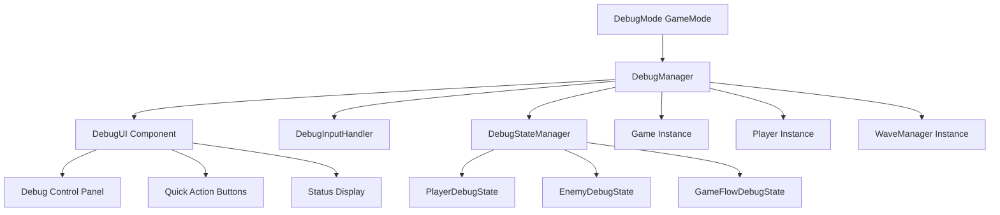

# 動作確認モード（デバッグモード）設計仕様書

## 📋 概要

Space Shooterゲームに開発者向けの動作確認モード（デバッグモード）を追加し、テスト支援機能を提供します。このモードにより、開発者は特定の状況を素早く再現し、バグの修正や機能テストを効率的に行うことができます。

## 🎯 主要機能

### 1. 基本デバッグ機能

#### 1.1 自機無敵モード
- **機能**: プレイヤーがダメージを受けない
- **実装**: `Player.ts`に`debugInvincible`フラグを追加
- **切り替え**: F2キーまたはUIボタン

#### 1.2 レベル/ウェーブ選択
- **機能**: 任意のレベルやウェーブから開始
- **実装**: `WaveManager`と連携してウェーブを直接設定
- **UI**: ドロップダウンメニューで選択

#### 1.3 敵タイプ指定生成
- **機能**: 特定の敵タイプを手動で生成
- **実装**: `GameObjectFactory`を使用して指定位置に敵を生成
- **操作**: 数字キー1-9で各敵タイプを生成

#### 1.4 特定シナリオ再現
- **機能**: ボス戦、特定の敵配置パターンなどを再現
- **実装**: 事前定義されたシナリオデータを読み込み
- **保存**: 現在の状態をシナリオとして保存可能

### 2. 追加支援機能

#### 2.1 時間制御
- **機能**: ゲーム速度の調整（0.5x, 1x, 2x, 5x）
- **実装**: `GameEngine`のdeltaTime乗算で実現
- **切り替え**: F3キーで時間停止/再開、UIで速度調整

#### 2.2 リソース管理
- **機能**: 体力・弾薬の無限化
- **実装**: プレイヤーの体力を最大値で固定
- **切り替え**: UIチェックボックス

#### 2.3 パワーアップテスト
- **機能**: 各パワーアップの即座発動
- **実装**: `PowerUpEffectService`を直接呼び出し
- **操作**: UIボタンで各パワーアップを発動

#### 2.4 衝突判定可視化
- **機能**: 当たり判定の境界表示
- **実装**: デバッグ描画モードでboundingBoxを表示
- **切り替え**: UIチェックボックス

## 🏗️ アーキテクチャ設計



## 📁 ファイル構造

```
src/
├── debug/
│   ├── DebugManager.ts          # デバッグ機能の中央管理
│   ├── DebugInputHandler.ts     # デバッグ用キー入力処理
│   ├── DebugStateManager.ts     # デバッグ状態管理
│   ├── DebugUI.tsx             # デバッグUI コンポーネント
│   ├── DebugRenderer.ts        # デバッグ描画機能
│   └── types/
│       └── DebugTypes.ts       # デバッグ関連の型定義
├── progression/data/
│   └── gameModes.ts            # デバッグモード追加
└── entities/
    └── Player.ts               # デバッグ機能統合
```

## 🔧 実装詳細

### 1. DebugManager クラス

```typescript
export class DebugManager {
  private isActive: boolean = false;
  private debugState: DebugState;
  private game: IGame;
  private player: Player;
  private waveManager: WaveManager;
  
  constructor(game: IGame, player: Player, waveManager: WaveManager) {
    this.game = game;
    this.player = player;
    this.waveManager = waveManager;
    this.debugState = new DebugState();
  }
  
  // 基本機能
  toggleInvincibility(): void {
    this.debugState.invincible = !this.debugState.invincible;
    this.player.setDebugInvincible(this.debugState.invincible);
  }
  
  setGameSpeed(multiplier: number): void {
    this.debugState.timeMultiplier = multiplier;
    this.game.setTimeMultiplier(multiplier);
  }
  
  jumpToWave(waveNumber: number): void {
    this.waveManager.jumpToWave(waveNumber);
  }
  
  spawnEnemy(type: EnemyType, position?: Vector2D): void {
    const enemy = this.game.getGameObjectFactory().createEnemy(type);
    if (position) {
      enemy.setPosition(position.x, position.y);
    }
    this.game.addEnemy(enemy);
  }
  
  // シナリオ再現
  loadScenario(scenarioId: string): void {
    const scenario = this.getScenario(scenarioId);
    this.applyScenario(scenario);
  }
  
  saveCurrentState(name: string): void {
    const scenario = this.captureCurrentState();
    this.saveScenario(name, scenario);
  }
  
  // UI表示制御
  toggleUI(): void {
    this.debugState.showUI = !this.debugState.showUI;
  }
  
  // 状態取得
  getDebugState(): DebugState {
    return { ...this.debugState };
  }
}
```

### 2. デバッグ用ゲームモード

```typescript
// src/progression/data/gameModes.ts に追加
{
  id: 'debug',
  name: 'デバッグモード',
  description: '開発者向けの動作確認モード。各種テスト機能が利用可能です。自機無敵、ウェーブ選択、敵生成、シナリオ再現などの機能を使用してゲームの動作を詳細に確認できます。',
  unlockCondition: () => true, // 常に利用可能
  modifiers: {
    enemySpeedMultiplier: 1.0,
    enemyHealthMultiplier: 1.0,
    enemySpawnRateMultiplier: 1.0,
    scoreMultiplier: 0.0, // デバッグモードではスコア無効
    coinMultiplier: 0.0,
    experienceMultiplier: 0.0,
  },
  specialRules: [
    'デバッグUI表示',
    'キーボードショートカット有効',
    'シナリオ再現機能',
    '各種テスト支援機能',
    'スコア・報酬無効'
  ],
  rewardMultiplier: 0.0, // デバッグモードでは報酬なし
}
```

### 3. DebugUI コンポーネント

```typescript
export const DebugUI: React.FC<DebugUIProps> = ({ debugManager }) => {
  const [debugState, setDebugState] = useState(debugManager.getDebugState());
  
  useEffect(() => {
    const interval = setInterval(() => {
      setDebugState(debugManager.getDebugState());
    }, 100);
    
    return () => clearInterval(interval);
  }, [debugManager]);
  
  return (
    <div className="debug-panel">
      <div className="debug-header">
        <h3>🛠️ デバッグモード</h3>
        <button onClick={() => debugManager.toggleUI()}>×</button>
      </div>
      
      <div className="debug-controls">
        <div className="debug-section">
          <h4>基本機能</h4>
          <button 
            className={debugState.invincible ? 'active' : ''}
            onClick={() => debugManager.toggleInvincibility()}
          >
            無敵モード {debugState.invincible ? 'ON' : 'OFF'}
          </button>
          
          <div className="control-group">
            <label>ウェーブ選択:</label>
            <select onChange={(e) => debugManager.jumpToWave(Number(e.target.value))}>
              <option value="">選択してください</option>
              {Array.from({length: 20}, (_, i) => (
                <option key={i+1} value={i+1}>ウェーブ {i+1}</option>
              ))}
            </select>
          </div>
          
          <div className="control-group">
            <label>ゲーム速度:</label>
            <select 
              value={debugState.timeMultiplier} 
              onChange={(e) => debugManager.setGameSpeed(Number(e.target.value))}
            >
              <option value={0}>停止</option>
              <option value={0.5}>0.5x</option>
              <option value={1}>1x (通常)</option>
              <option value={2}>2x</option>
              <option value={5}>5x</option>
            </select>
          </div>
        </div>
        
        <div className="debug-section">
          <h4>敵生成</h4>
          <div className="enemy-spawn-buttons">
            <button onClick={() => debugManager.spawnEnemy('SMALL')}>小敵</button>
            <button onClick={() => debugManager.spawnEnemy('MEDIUM')}>中敵</button>
            <button onClick={() => debugManager.spawnEnemy('LARGE')}>大敵</button>
          </div>
        </div>
        
        <div className="debug-section">
          <h4>パワーアップ</h4>
          <button onClick={() => debugManager.activatePowerUp('RAPID_FIRE')}>
            連射
          </button>
          <button onClick={() => debugManager.activatePowerUp('TRIPLE_SHOT')}>
            3WAY
          </button>
          <button onClick={() => debugManager.activatePowerUp('SHIELD')}>
            シールド
          </button>
        </div>
        
        <div className="debug-section">
          <h4>表示設定</h4>
          <label>
            <input 
              type="checkbox" 
              checked={debugState.showCollisionBoxes}
              onChange={(e) => debugManager.toggleCollisionBoxes(e.target.checked)}
            />
            当たり判定表示
          </label>
        </div>
      </div>
      
      <div className="debug-status">
        <h4>状態情報</h4>
        <div className="status-grid">
          <div>プレイヤー体力: {debugState.playerHealth}</div>
          <div>現在ウェーブ: {debugState.currentWave}</div>
          <div>敵数: {debugState.enemyCount}</div>
          <div>FPS: {debugState.fps}</div>
        </div>
      </div>
    </div>
  );
};
```

### 4. キーボードショートカット

| キー | 機能 | 説明 |
|------|------|------|
| F1 | デバッグパネル表示/非表示 | UIの表示切り替え |
| F2 | 無敵モード切替 | プレイヤーの無敵状態切り替え |
| F3 | 時間停止/再開 | ゲーム時間の停止/再開 |
| F4 | 次のウェーブへスキップ | 現在のウェーブを即座にクリア |
| F5 | 敵全削除 | 画面上の全ての敵を削除 |
| F6 | パワーアップ全取得 | 全てのパワーアップを同時発動 |
| 1 | 小敵生成 | 小型敵をランダム位置に生成 |
| 2 | 中敵生成 | 中型敵をランダム位置に生成 |
| 3 | 大敵生成 | 大型敵をランダム位置に生成 |
| 4-9 | 予約 | 将来の機能拡張用 |

### 5. DebugInputHandler クラス

```typescript
export class DebugInputHandler {
  private debugManager: DebugManager;
  private inputManager: IInputManager;
  
  constructor(debugManager: DebugManager, inputManager: IInputManager) {
    this.debugManager = debugManager;
    this.inputManager = inputManager;
    this.setupKeyBindings();
  }
  
  private setupKeyBindings(): void {
    this.inputManager.onKeyDown((key: string) => {
      switch (key) {
        case 'F1':
          this.debugManager.toggleUI();
          break;
        case 'F2':
          this.debugManager.toggleInvincibility();
          break;
        case 'F3':
          this.debugManager.toggleTimeStop();
          break;
        case 'F4':
          this.debugManager.skipToNextWave();
          break;
        case 'F5':
          this.debugManager.clearAllEnemies();
          break;
        case 'F6':
          this.debugManager.activateAllPowerUps();
          break;
        case '1':
          this.debugManager.spawnEnemy('SMALL');
          break;
        case '2':
          this.debugManager.spawnEnemy('MEDIUM');
          break;
        case '3':
          this.debugManager.spawnEnemy('LARGE');
          break;
      }
    });
  }
}
```

## 🔄 統合ポイント

### 1. Game.ts への統合

```typescript
export class Game implements IGame {
  private debugManager?: DebugManager;
  private debugInputHandler?: DebugInputHandler;
  
  constructor(...) {
    // 既存の初期化
    
    // デバッグモードの場合のみ初期化
    if (this.isDebugMode()) {
      this.initializeDebugMode();
    }
  }
  
  private isDebugMode(): boolean {
    // GameModeManagerから現在のモードを確認
    return this.getCurrentGameMode()?.id === 'debug';
  }
  
  private initializeDebugMode(): void {
    this.debugManager = new DebugManager(this, this.player, this.waveManager);
    this.debugInputHandler = new DebugInputHandler(this.debugManager, this.inputManager);
  }
  
  public getDebugManager(): DebugManager | undefined {
    return this.debugManager;
  }
}
```

### 2. Player.ts への統合

```typescript
export class Player extends GameObject implements IPlayer {
  private debugInvincible: boolean = false;
  
  public takeDamage(amount: number): void {
    if (this.debugInvincible) {
      return; // デバッグ無敵時はダメージ無効
    }
    
    // 既存のダメージ処理
    if (!this.invincible && !this.shieldActive) {
      const reducedDamage = this.applyDamageReduction(amount);
      this.health = Math.max(0, this.health - reducedDamage);
      this.eventEmitter.emit('healthChanged', this.health);
      this.invincible = true;
      this.lastHitTime = Date.now();
      if (this.health <= 0) {
        this.eventEmitter.emit('gameOver');
      }
    }
  }
  
  public setDebugInvincible(invincible: boolean): void {
    this.debugInvincible = invincible;
  }
  
  public isDebugInvincible(): boolean {
    return this.debugInvincible;
  }
}
```

## 🎮 使用方法

### 1. デバッグモード開始
1. ゲーム開始時にゲームモード選択画面で「デバッグモード」を選択
2. ゲーム開始後、F1キーでデバッグパネルを表示

### 2. 基本テスト手順
1. **無敵テスト**: F2キーで無敵モード切り替え、敵に当たってもダメージを受けないことを確認
2. **ウェーブジャンプ**: UIのドロップダウンで任意のウェーブを選択、即座に移動することを確認
3. **敵生成テスト**: 数字キー1-3で各種敵を生成、正しく表示されることを確認
4. **パワーアップテスト**: UIボタンで各パワーアップを発動、効果が適用されることを確認

### 3. シナリオテスト
1. 特定の状況を作り出す（例：ボス戦直前）
2. 「現在の状態を保存」でシナリオとして保存
3. 後で「シナリオ読み込み」で同じ状況を再現

## 📊 期待される効果

### 1. 開発効率向上
- **時間短縮**: 特定の状況を素早く再現（従来の1/10の時間）
- **バグ修正**: 問題の再現と修正確認が容易
- **機能テスト**: 新機能の動作確認が効率的

### 2. 品質保証
- **網羅的テスト**: 全てのゲーム状況をテスト可能
- **エッジケース**: 通常プレイでは発生しにくい状況もテスト
- **回帰テスト**: 修正後の動作確認が確実

### 3. デバッグ支援
- **問題特定**: 問題の原因を迅速に特定
- **修正確認**: 修正の効果を即座に確認
- **パフォーマンス**: ゲームパフォーマンスの監視

## 🚀 実装スケジュール

### Phase 1: 基本機能（1-2日）
- [ ] DebugManager基本クラス実装
- [ ] デバッグゲームモード追加
- [ ] 無敵機能実装
- [ ] 基本UIコンポーネント作成

### Phase 2: 拡張機能（2-3日）
- [ ] ウェーブ選択機能
- [ ] 敵生成機能
- [ ] 時間制御機能
- [ ] キーボードショートカット

### Phase 3: 高度機能（2-3日）
- [ ] シナリオ保存/読み込み
- [ ] 衝突判定可視化
- [ ] パフォーマンス監視
- [ ] UI改善とポリッシュ

### Phase 4: テスト・最適化（1-2日）
- [ ] 機能テスト
- [ ] パフォーマンステスト
- [ ] ドキュメント整備
- [ ] 最終調整

## 📝 注意事項

1. **パフォーマンス**: デバッグ機能は本番ビルドでは無効化
2. **セキュリティ**: デバッグモードでのスコア・報酬は無効
3. **互換性**: 既存のゲーム機能に影響を与えない設計
4. **保守性**: 将来の機能追加を考慮した拡張可能な設計

---

この設計仕様書に基づいて、動作確認モードの実装を開始します。