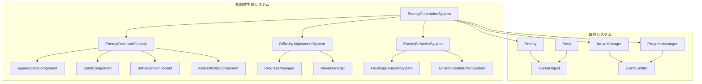

# 敵キャラクター動的生成システム設計計画

## 📋 システム概要

既存のSpace Shooterゲームに、プレイヤーが長時間楽しめる敵キャラクターの動的生成システムを統合します。基本的なランダム生成アプローチで、外見・能力・行動パターンを組み合わせ、プレイヤーレベルとウェーブ数に基づく難易度調整と基本的な群れ行動を実装します。

## 🎯 設計目標

- **長時間の楽しさ**: 毎回異なる敵との遭遇で飽きにくいゲームプレイ
- **適切な難易度**: プレイヤーの進行に応じた段階的な挑戦度向上
- **視覚的多様性**: ランダムな外見組み合わせによる新鮮な体験
- **戦術的深度**: 群れ行動と環境連携による戦略的要素
- **パフォーマンス**: 既存システムとの統合を保ちながら軽量な実装

## 🏗️ アーキテクチャ設計



## 🔧 コンポーネント設計

### 1. 動的敵生成コア

#### EnemyGenerationSystem
- **役割**: 敵生成の中央制御
- **機能**: 
  - ランダム敵の生成
  - 難易度調整の適用
  - 特殊能力の付与
  - 環境効果の適用

#### EnemyGeneratorFactory
- **役割**: 敵コンポーネントの組み合わせ
- **機能**:
  - 外見パーツの組み合わせ
  - 能力値の計算
  - 行動パターンの選択
  - 攻撃方法の決定

### 2. 敵コンポーネントシステム

#### AppearanceComponent
```typescript
interface AppearanceConfig {
  baseShape: 'hexagon' | 'triangle' | 'octagon' | 'star' | 'diamond';
  primaryColor: string;
  secondaryColor: string;
  accentColor: string;
  size: number;
  glowIntensity: number;
  animationSpeed: number;
  trailEffect: boolean;
}
```

**外見バリエーション**:
- **基本形状**: 5種類の幾何学形状
- **カラーパレット**: 15色の組み合わせ
- **サイズ**: 0.8x - 1.5x の範囲
- **エフェクト**: グロー、トレイル、パルス効果

#### StatsComponent
```typescript
interface EnemyStats {
  health: number;
  speed: number;
  attackPower: number;
  defense: number;
  fireRate: number;
  accuracy: number;
  experienceReward: number;
  scoreValue: number;
}
```

**能力値範囲**:
- **体力**: 基本値 × (0.8 - 1.3)
- **速度**: 基本値 × (0.7 - 1.4)
- **攻撃力**: 基本値 × (0.9 - 1.2)
- **発射レート**: 基本値 × (0.6 - 1.5)

#### BehaviorComponent
```typescript
type BehaviorPattern = 
  | 'straight'        // 直進
  | 'zigzag'         // ジグザグ
  | 'sine'           // サイン波
  | 'spiral'         // 螺旋
  | 'aggressive_chase'; // 積極的追跡

interface BehaviorConfig {
  pattern: BehaviorPattern;
  aggressiveness: number;      // 0.0 - 1.0
  flockingTendency: number;    // 0.0 - 1.0
  environmentalAwareness: number; // 0.0 - 1.0
}
```

#### AttackAbilityComponent
```typescript
interface AttackAbility {
  bulletType: 'single' | 'spread' | 'homing' | 'burst';
  bulletCount: number;
  bulletSpeed: number;
  specialEffects: SpecialEffect[];
}

type SpecialEffect = 
  | 'piercing'    // 貫通
  | 'explosive'   // 爆発
  | 'slowing'     // 減速
  | 'splitting';  // 分裂
```

### 3. 難易度調整システム

#### DifficultyAdjustmentSystem
```typescript
interface DifficultyFactors {
  playerLevel: number;
  currentWave: number;
  baseMultiplier: number;
  levelScaling: number;
  waveScaling: number;
}

interface DifficultyModifiers {
  healthMultiplier: number;
  speedMultiplier: number;
  attackMultiplier: number;
  specialAbilityChance: number;
  eliteEnemyChance: number;
}
```

**難易度計算式**:
```
基本倍率 = 1.0 + (プレイヤーレベル × 0.1) + (ウェーブ数 × 0.05)
体力倍率 = 基本倍率 × (1.0 + ランダム(-0.2, +0.3))
速度倍率 = 基本倍率 × (1.0 + ランダム(-0.1, +0.4))
攻撃倍率 = 基本倍率 × (1.0 + ランダム(-0.1, +0.2))
```

### 4. 群れ行動システム

#### FlockingBehaviorSystem
```typescript
interface FlockingRules {
  separationRadius: number;    // 分離距離
  alignmentRadius: number;     // 整列距離
  cohesionRadius: number;      // 結束距離
  leaderFollowDistance: number; // リーダー追従距離
  maxFlockSize: number;        // 最大群れサイズ
}
```

**群れ行動ルール**:
1. **分離**: 近すぎる敵から離れる
2. **整列**: 近くの敵と同じ方向に移動
3. **結束**: 群れの中心に向かう
4. **リーダー追従**: 指定されたリーダーに従う

### 5. 環境連携システム

#### EnvironmentalEffectSystem
```typescript
interface EnvironmentalEffect {
  triggerZone: 'nebula' | 'planet' | 'asteroid_field';
  effectType: 'speed_boost' | 'damage_boost' | 'shield_regen' | 'stealth';
  intensity: number;
  duration: number;
}
```

**環境効果**:
- **星雲エリア**: 速度+20%、ステルス効果
- **惑星近傍**: 攻撃力+15%、シールド再生
- **小惑星帯**: 防御力+10%、分裂攻撃

## 📊 実装フェーズ

### フェーズ1: 基盤システム構築 (1-2週間)
1. **EnemyGenerationSystem**の実装
   - 基本的なランダム生成ロジック
   - 既存Enemyクラスとの統合点作成
2. **基本コンポーネント**の作成
   - AppearanceComponent
   - StatsComponent
   - BehaviorComponent
   - AttackAbilityComponent
3. **既存Enemyクラス**の拡張
   - DynamicEnemyクラスの作成
   - 既存システムとの互換性維持
4. **基本テスト**の実装

### フェーズ2: 難易度調整システム (1週間)
1. **DifficultyAdjustmentSystem**の実装
   - プレイヤーレベル連携
   - ウェーブ数連携
2. **ProgressManager**との統合
   - レベル情報の取得
   - 経験値計算の調整
3. **WaveManager**との連携
   - ウェーブ情報の活用
   - 動的難易度適用
4. **バランステスト**の実施

### フェーズ3: 行動システム (1-2週間)
1. **新しい移動パターン**の追加
   - spiral（螺旋）パターン
   - aggressive_chase（積極的追跡）パターン
2. **FlockingBehaviorSystem**の実装
   - 基本的な群れ行動ルール
   - パフォーマンス最適化
3. **リーダー・フォロワー**システム
   - エリート敵のリーダー指定
   - フォロワー行動の実装
4. **行動テスト**の実施

### フェーズ4: 環境連携 (1週間)
1. **EnvironmentalEffectSystem**の実装
   - 背景オブジェクトとの距離計算
   - 効果適用ロジック
2. **背景オブジェクト**との相互作用
   - Nebula、Planet、その他との連携
   - 視覚的フィードバック
3. **環境ベース能力変化**の実装
   - 一時的な能力強化
   - 視覚エフェクトの追加

### フェーズ5: 特殊能力と最適化 (1-2週間)
1. **特殊攻撃パターン**の実装
   - ホーミング弾
   - 分裂弾
   - 爆発弾
2. **エリート敵**システム
   - 低確率で出現する強力な敵
   - 特別な報酬システム
3. **パフォーマンス最適化**
   - オブジェクトプールの活用
   - LODシステムとの統合
4. **最終バランス調整**

## 🔧 技術仕様

### ファイル構造
```
src/
├── systems/
│   ├── enemy-generation/
│   │   ├── EnemyGenerationSystem.ts
│   │   ├── EnemyGeneratorFactory.ts
│   │   ├── DifficultyAdjustmentSystem.ts
│   │   └── components/
│   │       ├── AppearanceComponent.ts
│   │       ├── StatsComponent.ts
│   │       ├── BehaviorComponent.ts
│   │       └── AttackAbilityComponent.ts
│   ├── behavior/
│   │   ├── FlockingBehaviorSystem.ts
│   │   └── EnvironmentalEffectSystem.ts
│   └── types/
│       └── EnemyGeneration.ts
├── entities/
│   ├── DynamicEnemy.ts (Enemyクラスの拡張)
│   └── EliteEnemy.ts
└── data/
    ├── EnemyTemplates.ts
    └── EnvironmentalZones.ts
```

### 既存システムとの統合点

#### WaveManagerとの統合
```typescript
// WaveManager.tsの拡張
private spawnDynamicEnemy(enemyConfig: WaveEnemyConfig, position: Vector2D): void {
    const dynamicEnemy = EnemyGenerationSystem.generateEnemy({
        baseType: enemyConfig.type,
        position: position,
        difficultyFactors: {
            playerLevel: this.game.getProgressManager().getLevel(),
            currentWave: this.currentWave
        }
    });
    this.game.addEnemy(dynamicEnemy);
}
```

#### ProgressManagerとの統合
```typescript
// ProgressManager.tsの拡張
public getDifficultyFactors(): DifficultyFactors {
    return {
        playerLevel: this.profile.level,
        currentWave: this.getCurrentWave(),
        baseMultiplier: 1.0,
        levelScaling: 0.1,
        waveScaling: 0.05
    };
}
```

### パフォーマンス考慮事項

#### オブジェクトプール活用
```typescript
// 既存のParticlePoolManagerを参考にした実装
class DynamicEnemyPool extends ObjectPool<DynamicEnemy> {
    protected createObject(): DynamicEnemy {
        return new DynamicEnemy();
    }
    
    protected resetObject(enemy: DynamicEnemy): void {
        enemy.reset();
        enemy.applyRandomConfiguration();
    }
}
```

#### 空間分割による最適化
```typescript
// 群れ行動計算の最適化
class FlockingSpatialHash {
    private grid: Map<string, DynamicEnemy[]> = new Map();
    private cellSize: number = 100;
    
    public getNearbyEnemies(enemy: DynamicEnemy, radius: number): DynamicEnemy[] {
        // 空間ハッシュを使用した効率的な近傍検索
    }
}
```

## 🎮 ゲームプレイ体験

### プレイヤーが体験する変化

#### 視覚的多様性
- **外見の組み合わせ**: 5形状 × 15色 × エフェクト = 数百通りの組み合わせ
- **サイズバリエーション**: 同じ敵タイプでも異なるサイズ
- **アニメーション**: 個体ごとに異なる動きの速度と強度

#### 戦術的変化
- **攻撃パターン**: 単発、拡散、ホーミング、バースト
- **移動パターン**: 5種類の基本パターン + 群れ行動
- **特殊能力**: 貫通、爆発、減速、分裂効果

#### 進行感
- **明確な難易度上昇**: レベルとウェーブに応じた段階的強化
- **エリート敵**: 特別な挑戦と報酬
- **環境活用**: 背景が戦略的要素として機能

#### 群れ行動による新体験
- **協調攻撃**: 複数の敵が連携した攻撃パターン
- **リーダー戦術**: エリート敵を倒すことで群れを無力化
- **環境利用**: 背景オブジェクトを活用した戦術

### バランス設計

#### 基本難易度計算
```
基本倍率 = 1.0 + (プレイヤーレベル × 0.1) + (ウェーブ数 × 0.05)

例：
- レベル5、ウェーブ10: 1.0 + 0.5 + 0.5 = 2.0倍
- レベル10、ウェーブ20: 1.0 + 1.0 + 1.0 = 3.0倍
```

#### 特殊要素の出現率
- **特殊能力**: 10% + (レベル × 2%) 最大30%
- **エリート敵**: 5% + (ウェーブ数 × 1%) 最大20%
- **環境効果**: 背景オブジェクト近傍で100%発動

#### 群れ行動パラメータ
- **基本群れサイズ**: 3-5体
- **高難易度群れサイズ**: 5-7体
- **リーダー出現率**: 群れサイズ4以上で50%

## 🧪 テスト戦略

### 単体テスト
```typescript
describe('EnemyGenerationSystem', () => {
    test('ランダム生成の分布が適切', () => {
        // 1000回生成して分布を検証
    });
    
    test('難易度計算が正確', () => {
        // 各レベル・ウェーブでの倍率計算
    });
    
    test('コンポーネント組み合わせが有効', () => {
        // 無効な組み合わせが生成されないことを確認
    });
});
```

### 統合テスト
```typescript
describe('システム統合', () => {
    test('既存Enemyクラスとの互換性', () => {
        // 既存の敵生成システムが正常動作
    });
    
    test('WaveManagerとの連携', () => {
        // ウェーブ進行時の動的敵生成
    });
    
    test('ProgressManagerとの連携', () => {
        // レベルアップ時の難易度調整
    });
});
```

### パフォーマンステスト
```typescript
describe('パフォーマンス', () => {
    test('大量敵生成時のフレームレート', () => {
        // 50体同時生成時のFPS測定
    });
    
    test('群れ行動計算の負荷', () => {
        // 複数群れ同時存在時の計算時間
    });
    
    test('メモリ使用量', () => {
        // オブジェクトプール効果の確認
    });
});
```

### プレイテスト項目
1. **長時間プレイでの飽きにくさ**
   - 30分プレイでの新鮮さ維持
   - 視覚的多様性の評価
2. **難易度カーブの適切性**
   - 初心者から上級者まで楽しめる調整
   - 挫折感と達成感のバランス
3. **群れ行動の面白さ**
   - 戦術的深度の向上
   - 理不尽さの回避

## 📈 成功指標

### 定量的指標
- **プレイ時間**: 平均セッション時間20%向上
- **リテンション**: 7日後継続率15%向上
- **パフォーマンス**: FPS低下5%以内に抑制

### 定性的指標
- **プレイヤーフィードバック**: 「毎回違う体験」の評価
- **戦術的深度**: 「考えて戦う楽しさ」の向上
- **視覚的満足度**: 「見た目の多様性」への好評価

## 🚀 将来の拡張可能性

### 短期拡張 (3-6ヶ月)
- **新しい特殊能力**: テレポート、時間停止、分身
- **環境の追加**: ブラックホール、ワームホール
- **ボス敵の動的生成**: 通常敵の組み合わせによるボス生成

### 中期拡張 (6-12ヶ月)
- **学習AI**: プレイヤーの行動パターンに適応する敵
- **進化システム**: 敵が戦闘中に能力を獲得
- **生態系シミュレーション**: 敵種族間の相互作用

### 長期拡張 (1年以上)
- **プロシージャル宇宙**: 動的に生成される星系と敵文明
- **ストーリー生成**: 敵の行動から自動生成される物語
- **マルチプレイヤー対応**: 協力・対戦モードでの動的敵生成

---

## 📝 実装開始準備

この設計計画に基づいて実装を開始する準備が整いました。次のステップとして、Codeモードに切り替えてフェーズ1の実装を開始することをお勧めします。

### 実装開始時の優先順位
1. **EnemyGenerationSystem**の基本構造
2. **AppearanceComponent**による視覚的多様性
3. **StatsComponent**による能力値バリエーション
4. **既存システムとの統合テスト**

この計画により、プレイヤーが長時間楽しめる、予測不可能で新鮮な戦闘体験を提供する敵キャラクター動的生成システムを構築できます。