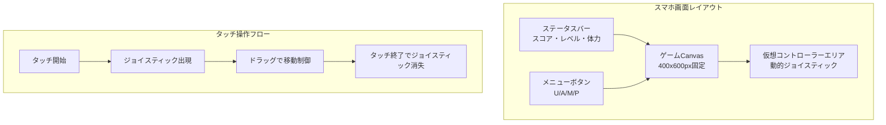
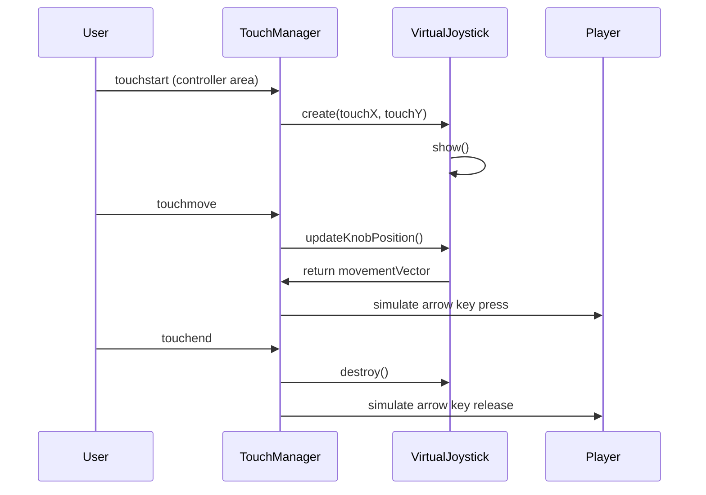
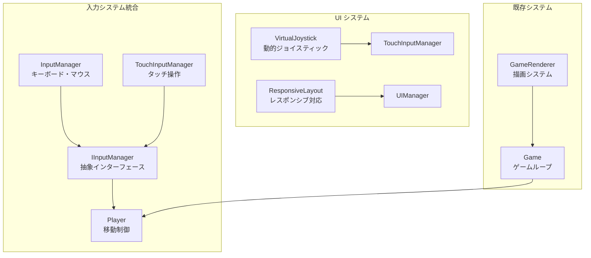

# スペースシューターゲーム スマホ対応UI設計書

## 1. 設計概要

### 1.1 設計目標
- 現在の固定Canvas（400x600px）を維持しつつスマホ対応を実現
- 動的仮想ジョイスティック（タッチ位置に出現・離すと消失）による直感的操作
- 既存のモジュラー設計（IInputManager抽象化）を活用した段階的実装
- 自動射撃システムを維持し、移動操作に特化したUI設計

### 1.2 技術方針
- **既存システム保持**: 現在のゲームロジック・レンダリングシステムを変更せず
- **抽象化活用**: IInputManagerインターフェースを通じた入力システム拡張
- **段階的実装**: Phase 1-4の段階的開発アプローチ
- **パフォーマンス重視**: モバイル端末での60FPS維持

## 2. 現在のシステム分析

### 2.1 既存入力システム
```typescript
// 現在のInputManager（キーボード・マウス対応）
class InputManager implements IInputManager {
  // キーボード: ArrowKeys（移動）、Space（射撃 - 現在は自動化済み）
  // マウス: 座標追跡、クリック操作
  // 物理ベース移動: 加速度・減速・慣性システム
}
```

### 2.2 プレイヤー操作システム
```typescript
// Player.ts - 現在の移動ロジック
private updateVelocity(): void {
  // X軸: ArrowLeft/ArrowRight → 加速度ベース移動
  // Y軸: ArrowUp/ArrowDown → 加速度ベース移動
  // 自動射撃: 200ms間隔で弾丸生成
}
```

## 3. スマホ対応UI設計

### 3.1 レイアウト設計



### 3.2 動的仮想ジョイスティック仕様

#### 3.2.1 基本動作
- **出現条件**: 画面下部エリア（Canvas外）をタッチ
- **表示**: タッチ位置を中心とした半透明ジョイスティック
- **操作**: ドラッグ距離・方向で移動ベクトル計算
- **消失**: タッチ終了で即座に非表示

#### 3.2.2 視覚デザイン
```css
.virtual-joystick {
  position: absolute;
  width: 120px;
  height: 120px;
  background: radial-gradient(circle, rgba(0,255,170,0.3), rgba(0,255,170,0.1));
  border: 2px solid rgba(0,255,170,0.6);
  border-radius: 50%;
  backdrop-filter: blur(5px);
}

.joystick-knob {
  width: 40px;
  height: 40px;
  background: rgba(0,255,170,0.8);
  border-radius: 50%;
  box-shadow: 0 0 15px rgba(0,255,170,0.5);
}
```

### 3.3 レスポンシブレイアウト

#### 3.3.1 画面サイズ対応
```css
/* スマホ縦持ち (320px-480px) */
@media (max-width: 480px) and (orientation: portrait) {
  #game-container {
    flex-direction: column;
    padding: 10px;
  }
  
  #gameCanvas {
    width: 400px;
    height: 600px;
    max-width: 90vw;
    max-height: 60vh;
  }
  
  .virtual-controller-area {
    height: 25vh;
    min-height: 150px;
  }
}

/* タブレット (481px-768px) */
@media (min-width: 481px) and (max-width: 768px) {
  .virtual-controller-area {
    height: 20vh;
    min-height: 120px;
  }
}
```

#### 3.3.2 UI要素配置
- **上部**: ステータス表示（スコア・レベル・体力）
- **中央**: ゲームCanvas（400x600px固定）
- **下部**: 仮想コントローラーエリア（25vh）
- **右上**: メニューボタン群（縦配置）

## 4. 技術実装設計

### 4.1 Phase 1: TouchInputManager実装

#### 4.1.1 TouchInputManager クラス設計
```typescript
export class TouchInputManager implements IInputManager {
  private touchState = new Map<number, TouchPoint>();
  private virtualJoystick: VirtualJoystick | null = null;
  private currentMovement: Vector2D = { x: 0, y: 0 };
  
  // IInputManager互換メソッド
  public isKeyPressed(key: string): boolean {
    // タッチ状態をキー入力に変換
    return this.convertTouchToKey(key);
  }
  
  public getMousePosition(): Vector2D {
    // 仮想ジョイスティックの位置を返す
    return this.virtualJoystick?.getPosition() ?? { x: 0, y: 0 };
  }
  
  // タッチイベントハンドラー
  private handleTouchStart(event: TouchEvent): void;
  private handleTouchMove(event: TouchEvent): void;
  private handleTouchEnd(event: TouchEvent): void;
}

interface TouchPoint {
  id: number;
  startX: number;
  startY: number;
  currentX: number;
  currentY: number;
  isJoystick: boolean;
}
```

#### 4.1.2 VirtualJoystick クラス設計
```typescript
export class VirtualJoystick {
  private centerX: number;
  private centerY: number;
  private knobX: number;
  private knobY: number;
  private maxDistance: number = 50;
  private element: HTMLElement;
  
  constructor(x: number, y: number) {
    this.centerX = x;
    this.centerY = y;
    this.createElement();
  }
  
  public updateKnobPosition(x: number, y: number): Vector2D {
    // ノブ位置更新と移動ベクトル計算
    const deltaX = x - this.centerX;
    const deltaY = y - this.centerY;
    const distance = Math.sqrt(deltaX * deltaX + deltaY * deltaY);
    
    if (distance <= this.maxDistance) {
      this.knobX = x;
      this.knobY = y;
    } else {
      // 最大距離で制限
      const angle = Math.atan2(deltaY, deltaX);
      this.knobX = this.centerX + Math.cos(angle) * this.maxDistance;
      this.knobY = this.centerY + Math.sin(angle) * this.maxDistance;
    }
    
    return this.getMovementVector();
  }
  
  private getMovementVector(): Vector2D {
    const deltaX = this.knobX - this.centerX;
    const deltaY = this.knobY - this.centerY;
    return {
      x: deltaX / this.maxDistance, // -1 to 1
      y: deltaY / this.maxDistance  // -1 to 1
    };
  }
}
```

### 4.2 Phase 2: 動的仮想ジョイスティックUI

#### 4.2.1 UI コンポーネント構造
```html
<!-- 新しいHTML構造 -->
<div id="game-container">
  <div id="status-bar">
    <!-- 既存のスコア・レベル・体力表示 -->
  </div>
  
  <canvas id="gameCanvas"></canvas>
  
  <div id="virtual-controller-area">
    <!-- 動的に生成される仮想ジョイスティック -->
  </div>
  
  <div id="menu-buttons">
    <!-- 既存のメニューボタン群 -->
  </div>
</div>
```

#### 4.2.2 タッチ操作フロー


### 4.3 Phase 3: レスポンシブレイアウト

#### 4.3.1 CSS Grid レイアウト
```css
#game-container {
  display: grid;
  grid-template-rows: auto 1fr auto;
  grid-template-areas: 
    "status"
    "canvas"
    "controller";
  height: 100vh;
  max-height: 100vh;
}

#status-bar { grid-area: status; }
#gameCanvas { grid-area: canvas; justify-self: center; }
#virtual-controller-area { grid-area: controller; }

@media (max-width: 480px) {
  #game-container {
    grid-template-rows: 60px 1fr 150px;
  }
}
```

#### 4.3.2 Canvas スケーリング
```typescript
export class CanvasScaler {
  public static scaleCanvas(canvas: HTMLCanvasElement): void {
    const container = canvas.parentElement!;
    const containerWidth = container.clientWidth;
    const containerHeight = container.clientHeight;
    
    // アスペクト比維持（400:600 = 2:3）
    const aspectRatio = 400 / 600;
    let canvasWidth = Math.min(containerWidth * 0.9, 400);
    let canvasHeight = canvasWidth / aspectRatio;
    
    if (canvasHeight > containerHeight * 0.7) {
      canvasHeight = containerHeight * 0.7;
      canvasWidth = canvasHeight * aspectRatio;
    }
    
    canvas.style.width = `${canvasWidth}px`;
    canvas.style.height = `${canvasHeight}px`;
  }
}
```

### 4.4 Phase 4: パフォーマンス最適化

#### 4.4.1 タッチイベント最適化
```typescript
export class TouchEventOptimizer {
  private lastTouchTime = 0;
  private readonly THROTTLE_MS = 16; // 60FPS
  
  public throttledTouchMove(callback: (event: TouchEvent) => void) {
    return (event: TouchEvent) => {
      const now = performance.now();
      if (now - this.lastTouchTime >= this.THROTTLE_MS) {
        callback(event);
        this.lastTouchTime = now;
      }
    };
  }
  
  public preventDefaultTouch(element: HTMLElement): void {
    element.addEventListener('touchstart', (e) => e.preventDefault(), { passive: false });
    element.addEventListener('touchmove', (e) => e.preventDefault(), { passive: false });
  }
}
```

#### 4.4.2 メモリ管理
```typescript
export class VirtualJoystickPool {
  private pool: VirtualJoystick[] = [];
  private active: VirtualJoystick[] = [];
  
  public acquire(x: number, y: number): VirtualJoystick {
    let joystick = this.pool.pop();
    if (!joystick) {
      joystick = new VirtualJoystick(x, y);
    } else {
      joystick.reset(x, y);
    }
    this.active.push(joystick);
    return joystick;
  }
  
  public release(joystick: VirtualJoystick): void {
    const index = this.active.indexOf(joystick);
    if (index !== -1) {
      this.active.splice(index, 1);
      joystick.hide();
      this.pool.push(joystick);
    }
  }
}
```

## 5. 実装アーキテクチャ

### 5.1 システム統合設計



### 5.2 設定システム拡張

```typescript
// GameConfigFactory.ts 拡張
export interface TouchConfig {
  joystick: {
    size: number;
    maxDistance: number;
    sensitivity: number;
    fadeTime: number;
  };
  controllerArea: {
    height: string; // CSS値
    minHeight: number;
  };
  responsiveness: {
    throttleMs: number;
    enableHaptics: boolean;
  };
}

export function createTouchConfig(): TouchConfig {
  return {
    joystick: {
      size: 120,
      maxDistance: 50,
      sensitivity: 1.0,
      fadeTime: 200
    },
    controllerArea: {
      height: '25vh',
      minHeight: 150
    },
    responsiveness: {
      throttleMs: 16,
      enableHaptics: true
    }
  };
}
```

### 5.3 デバイス検出システム

```typescript
export class DeviceDetector {
  public static isTouchDevice(): boolean {
    return 'ontouchstart' in window || navigator.maxTouchPoints > 0;
  }
  
  public static isMobile(): boolean {
    return /Android|webOS|iPhone|iPad|iPod|BlackBerry|IEMobile|Opera Mini/i.test(
      navigator.userAgent
    );
  }
  
  public static getInputManager(canvas: HTMLCanvasElement): IInputManager {
    if (this.isTouchDevice()) {
      return new TouchInputManager(canvas);
    } else {
      return new InputManager(canvas);
    }
  }
}
```

## 6. 段階的実装計画

### 6.1 Phase 1: TouchInputManager実装 (Week 1-2)
- [ ] TouchInputManager基本クラス作成
- [ ] IInputManager互換性確保
- [ ] 基本タッチイベント処理
- [ ] 単体テスト作成

### 6.2 Phase 2: 動的仮想ジョイスティックUI (Week 3-4)
- [ ] VirtualJoystick クラス実装
- [ ] 動的生成・削除システム
- [ ] CSS アニメーション実装
- [ ] タッチ操作フロー統合

### 6.3 Phase 3: レスポンシブレイアウト (Week 5)
- [ ] CSS Grid レイアウト実装
- [ ] 画面サイズ対応
- [ ] Canvas スケーリング
- [ ] メニューボタン最適化

### 6.4 Phase 4: パフォーマンス最適化 (Week 6)
- [ ] タッチイベント最適化
- [ ] メモリプール実装
- [ ] バッテリー消費軽減
- [ ] 統合テスト・調整

## 7. テスト戦略

### 7.1 単体テスト
```typescript
describe('TouchInputManager', () => {
  test('should convert touch to arrow key simulation', () => {
    const touchManager = new TouchInputManager(mockCanvas);
    const mockTouch = createMockTouch(100, 50); // 右上方向
    
    touchManager.handleTouchMove(mockTouch);
    
    expect(touchManager.isKeyPressed('ArrowRight')).toBe(true);
    expect(touchManager.isKeyPressed('ArrowUp')).toBe(true);
  });
});
```

### 7.2 統合テスト
- 既存ゲームロジックとの互換性確認
- 複数デバイスでの動作テスト
- パフォーマンス測定（FPS・メモリ使用量）

## 8. 技術仕様詳細

### 8.1 座標変換システム
```typescript
export class CoordinateConverter {
  public static touchToCanvas(
    touch: Touch, 
    canvas: HTMLCanvasElement
  ): Vector2D {
    const rect = canvas.getBoundingClientRect();
    const scaleX = canvas.width / rect.width;
    const scaleY = canvas.height / rect.height;
    
    return {
      x: (touch.clientX - rect.left) * scaleX,
      y: (touch.clientY - rect.top) * scaleY
    };
  }
}
```

### 8.2 触覚フィードバック
```typescript
export class HapticFeedback {
  public static vibrate(pattern: number | number[]): void {
    if ('vibrate' in navigator) {
      navigator.vibrate(pattern);
    }
  }
  
  public static lightTap(): void {
    this.vibrate(10);
  }
  
  public static mediumTap(): void {
    this.vibrate(50);
  }
}
```

## 9. UI/UX設計詳細

### 9.1 視覚的フィードバック
- **ジョイスティック出現**: 0.2秒のフェードイン効果
- **ノブ移動**: リアルタイム追従、最大距離での制限表示
- **タッチ終了**: 0.1秒のフェードアウト効果

### 9.2 操作性向上
- **デッドゾーン**: 中心から10px以内は無効化
- **感度調整**: 設定可能な移動感度
- **誤操作防止**: メニューエリアとの分離

### 9.3 アクセシビリティ
- **高コントラスト**: 視認性の高い色彩設計
- **サイズ調整**: 指の太さを考慮したUI要素サイズ
- **フィードバック**: 触覚・視覚・音響フィードバックの組み合わせ

## 10. パフォーマンス指標

### 10.1 目標値
- **フレームレート**: 60FPS維持
- **タッチ遅延**: 16ms以下
- **メモリ使用量**: 追加50MB以下
- **バッテリー消費**: 従来比+20%以下

### 10.2 最適化手法
- **イベントスロットリング**: 60FPS制限
- **オブジェクトプール**: VirtualJoystick再利用
- **CSS最適化**: GPU加速の活用
- **メモリ管理**: 適切なクリーンアップ

この設計書により、既存のスペースシューターゲームに対して、システム構造を維持しながら効果的なスマホ対応を実現できます。段階的な実装アプローチにより、リスクを最小化しながら高品質なモバイル体験を提供します。