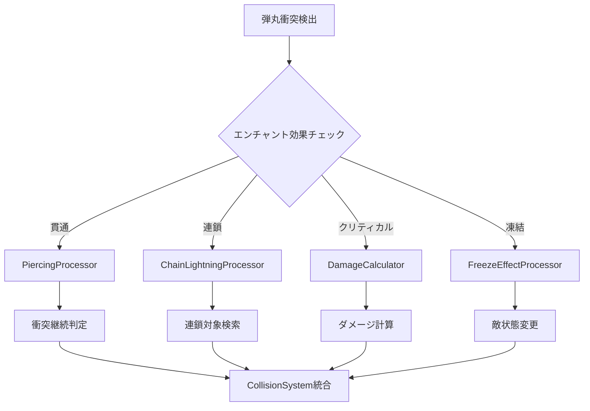

# 武器エンチャント効果未実装部分の技術設計書

## 📋 現在の実装状況分析

### ✅ 完全実装済み効果
- **爆発効果**: [`ExplosiveBullet`](src/entities/bullets/ExplosiveBullet.ts:1) クラスで完全実装
- **追尾効果**: [`HomingBullet`](src/entities/bullets/HomingBullet.ts:1) クラスで完全実装  
- **分裂効果**: [`SplitBullet`](src/entities/bullets/SplitBullet.ts:1) クラスで完全実装
- **反射効果**: [`ReflectingBullet`](src/entities/bullets/ReflectingBullet.ts:1) クラスで完全実装

### ⚠️ 設定可能だが動作未実装の効果
- **貫通効果**: [`Bullet.setPiercing()`](src/entities/Bullet.ts:461) で設定可能だが、[`CollisionSystem`](src/systems/CollisionSystem.ts:83) で即座に `deactivate()` される
- **連鎖効果**: [`Bullet.setChainLightning()`](src/entities/Bullet.ts:482) で設定可能だが実際の連鎖処理が未実装
- **クリティカル効果**: [`Bullet.setCriticalChance()`](src/entities/Bullet.ts:506) で設定可能だがダメージ計算処理が未実装
- **凍結効果**: エンチャント設定は存在するが [`Enemy`](src/entities/Enemy.ts:1) クラスに凍結状態管理が未実装

## 🎯 実装が必要な機能

### 1. 貫通効果の実装

#### 問題点
現在の [`CollisionSystem.checkBulletEnemyCollisions()`](src/systems/CollisionSystem.ts:63) では、弾丸が敵に衝突すると即座に [`bullet.deactivate()`](src/systems/CollisionSystem.ts:83) が呼ばれるため、貫通効果が機能しない。

#### 解決策
```typescript
// CollisionSystem.ts の修正案
private checkBulletEnemyCollisions(): void {
  bullets.forEach(bullet => {
    if (!bullet.isActive()) return;
    
    let hitCount = 0;
    const maxPiercing = bullet.getPiercingCount();
    
    for (const nearbyObj of nearbyObjects) {
      if (this.isEnemy(nearbyObj) && enemies.includes(nearbyObj)) {
        if (this.checkCollision(bullet, nearbyObj)) {
          hitCount++;
          
          if (nearbyObj.takeDamage()) {
            this.eventEmitter.emit('enemyDestroyed', nearbyObj);
            this.gameObjectManager.removeEnemy(nearbyObj);
          }
          
          // 貫通回数チェック
          if (!bullet.isPiercing() || hitCount >= maxPiercing) {
            bullet.deactivate();
            break;
          }
        }
      }
    }
  });
}
```

### 2. 連鎖効果の実装

#### 新規クラス: `ChainLightningProcessor`
```typescript
export class ChainLightningProcessor {
  constructor(
    private gameObjectManager: GameObjectManager,
    private eventEmitter: EventEmitter<EventMap>
  ) {}

  processChainLightning(
    originPosition: Vector2D,
    chainCount: number,
    damage: number,
    chainRange: number = 100
  ): void {
    const enemies = this.gameObjectManager.getEnemies();
    const processedEnemies = new Set<Enemy>();
    
    let currentTargets = [this.findNearestEnemy(originPosition, enemies)];
    let remainingChains = chainCount;
    
    while (remainingChains > 0 && currentTargets.length > 0) {
      const nextTargets: Enemy[] = [];
      
      for (const target of currentTargets) {
        if (!target || processedEnemies.has(target)) continue;
        
        processedEnemies.add(target);
        
        // ダメージ適用
        if (target.takeDamage()) {
          this.eventEmitter.emit('enemyDestroyed', target);
          this.gameObjectManager.removeEnemy(target);
        }
        
        // 次の連鎖対象を探す
        const nextTarget = this.findNearestEnemy(
          target.getPosition(),
          enemies.filter(e => !processedEnemies.has(e)),
          chainRange
        );
        
        if (nextTarget) {
          nextTargets.push(nextTarget);
        }
      }
      
      currentTargets = nextTargets;
      remainingChains--;
    }
  }

  private findNearestEnemy(
    position: Vector2D,
    enemies: Enemy[],
    maxRange: number = Infinity
  ): Enemy | null {
    let nearestEnemy: Enemy | null = null;
    let nearestDistance = maxRange;

    for (const enemy of enemies) {
      const enemyPos = enemy.getPosition();
      const distance = Math.sqrt(
        Math.pow(enemyPos.x - position.x, 2) + 
        Math.pow(enemyPos.y - position.y, 2)
      );

      if (distance < nearestDistance) {
        nearestDistance = distance;
        nearestEnemy = enemy;
      }
    }

    return nearestEnemy;
  }
}
```

### 3. クリティカル効果の実装

#### 新規クラス: `DamageCalculator`
```typescript
export class DamageCalculator {
  static calculateDamage(
    baseDamage: number,
    criticalChance: number,
    criticalMultiplier: number = 2.0
  ): { damage: number; isCritical: boolean } {
    const isCritical = Math.random() < (criticalChance / 100);
    const damage = isCritical ? baseDamage * criticalMultiplier : baseDamage;
    
    return { damage, isCritical };
  }
}
```

#### [`Enemy`](src/entities/Enemy.ts:221) クラスの拡張
```typescript
// Enemy.ts の修正案
export class Enemy extends GameObject {
  private criticalEffectTime: number = 0;

  public takeDamage(damage: number = 1, isCritical: boolean = false): boolean {
    this.health -= damage;
    
    if (isCritical) {
      // クリティカル視覚効果
      this.showCriticalEffect();
    }
    
    return this.health <= 0;
  }

  private showCriticalEffect(): void {
    // クリティカルヒット時の視覚効果
    this.criticalEffectTime = Date.now();
  }

  public draw(ctx: CanvasRenderingContext2D): void {
    // 既存の描画処理...
    
    // クリティカル効果の描画
    if (this.criticalEffectTime > 0 && Date.now() - this.criticalEffectTime < 500) {
      ctx.save();
      ctx.shadowColor = '#FFD700';
      ctx.shadowBlur = 20;
      ctx.strokeStyle = '#FFD700';
      ctx.lineWidth = 3;
      ctx.strokeRect(this.x - 5, this.y - 5, this.width + 10, this.height + 10);
      ctx.restore();
    }
  }
}
```

### 4. 凍結効果の実装

#### [`Enemy`](src/entities/Enemy.ts:1) クラスの状態管理拡張
```typescript
// Enemy.ts の修正案
export class Enemy extends GameObject {
  private frozen: boolean = false;
  private freezeEndTime: number = 0;
  private originalSpeed: number;

  constructor(/* 既存のパラメータ */) {
    // 既存のコンストラクタ処理...
    this.originalSpeed = this.speed;
  }

  public freeze(duration: number): void {
    this.frozen = true;
    this.freezeEndTime = Date.now() + duration * 1000;
    this.speed = 0;
  }

  public update(deltaTime: number): void {
    // 凍結状態チェック
    if (this.frozen && Date.now() > this.freezeEndTime) {
      this.unfreeze();
    }

    if (!this.frozen) {
      // 通常の移動処理
      super.update(deltaTime);
    }
  }

  private unfreeze(): void {
    this.frozen = false;
    this.speed = this.originalSpeed;
  }

  public isFrozen(): boolean {
    return this.frozen;
  }

  public draw(ctx: CanvasRenderingContext2D): void {
    // 既存の描画処理...
    
    // 凍結効果の描画
    if (this.frozen) {
      ctx.save();
      ctx.fillStyle = 'rgba(173, 216, 230, 0.6)';
      ctx.fillRect(this.x, this.y, this.width, this.height);
      
      // 氷の結晶エフェクト
      ctx.strokeStyle = '#87CEEB';
      ctx.lineWidth = 2;
      const centerX = this.x + this.width / 2;
      const centerY = this.y + this.height / 2;
      const size = Math.min(this.width, this.height) / 4;
      
      // 雪の結晶パターン
      for (let i = 0; i < 6; i++) {
        const angle = (i / 6) * Math.PI * 2;
        ctx.beginPath();
        ctx.moveTo(centerX, centerY);
        ctx.lineTo(
          centerX + Math.cos(angle) * size,
          centerY + Math.sin(angle) * size
        );
        ctx.stroke();
      }
      
      ctx.restore();
    }
  }
}
```

## 🏗️ システム統合設計

### エンチャント効果処理システム


### 新規クラス構造
```typescript
// 新規作成が必要なクラス
export class EnchantmentEffectProcessor {
  private chainProcessor: ChainLightningProcessor;

  constructor(
    private gameObjectManager: GameObjectManager,
    private eventEmitter: EventEmitter<EventMap>
  ) {
    this.chainProcessor = new ChainLightningProcessor(
      gameObjectManager,
      eventEmitter
    );
  }

  processEffects(bullet: Bullet, hitEnemy: Enemy): void {
    // クリティカル判定とダメージ計算
    const damageResult = DamageCalculator.calculateDamage(
      1, // ベースダメージ
      bullet.getCriticalChance()
    );
    
    const shouldDestroy = hitEnemy.takeDamage(
      damageResult.damage,
      damageResult.isCritical
    );
    
    if (shouldDestroy) {
      this.eventEmitter.emit('enemyDestroyed', hitEnemy);
      this.gameObjectManager.removeEnemy(hitEnemy);
      
      // 連鎖効果処理
      if (bullet.hasChainLightning()) {
        this.chainProcessor.processChainLightning(
          hitEnemy.getPosition(),
          bullet.getChainCount(),
          damageResult.damage
        );
      }
    }
    
    // 凍結効果処理
    if (this.hasFreezeEffect(bullet)) {
      hitEnemy.freeze(this.getFreezeDuration(bullet));
    }
  }

  private hasFreezeEffect(bullet: Bullet): boolean {
    // Bulletクラスに凍結効果メソッドを追加する必要がある
    return bullet.getEnchantments().some(e => e.type === 'FREEZE_EFFECT');
  }

  private getFreezeDuration(bullet: Bullet): number {
    const freezeEnchantment = bullet.getEnchantments()
      .find(e => e.type === 'FREEZE_EFFECT');
    return freezeEnchantment?.value || 2;
  }
}
```

## 📊 実装優先順位

### Phase 1: 基本効果実装（1-2日）
1. **貫通効果**: [`CollisionSystem`](src/systems/CollisionSystem.ts:63) の修正
2. **クリティカル効果**: `DamageCalculator` クラス作成
3. **凍結効果**: [`Enemy`](src/entities/Enemy.ts:1) クラスの状態管理拡張

### Phase 2: 連鎖効果実装（1-2日）
1. **連鎖効果**: `ChainLightningProcessor` クラス作成
2. **効果統合**: `EnchantmentEffectProcessor` クラス作成

### Phase 3: システム統合・最適化（1日）
1. **パフォーマンス最適化**: 効果処理の最適化
2. **テスト・デバッグ**: 各効果の動作確認

## 🔧 具体的な実装アプローチ

### 1. [`CollisionSystem`](src/systems/CollisionSystem.ts:63) の修正
```typescript
// 既存のcheckBulletEnemyCollisions()メソッドを以下のように修正
private checkBulletEnemyCollisions(): void {
  const bullets = this.gameObjectManager.getBullets();
  const enemies = this.gameObjectManager.getEnemies();

  if (bullets.length === 0 || enemies.length === 0) return;

  bullets.forEach(bullet => {
    if (!bullet.isActive()) return;

    const nearbyObjects = this.collisionOptimizer
      .getSpatialHash()
      .getNearby(bullet);
    this.spatialHashChecks += nearbyObjects.size;
    this.totalChecks += enemies.length;
    
    let hitCount = 0;
    const maxPiercing = bullet.isPiercing() ? bullet.getPiercingCount() : 0;

    for (const nearbyObj of nearbyObjects) {
      if (this.isEnemy(nearbyObj) && enemies.includes(nearbyObj)) {
        if (this.checkCollision(bullet, nearbyObj)) {
          hitCount++;
          
          // エンチャント効果処理
          this.processEnchantmentEffects(bullet, nearbyObj);
          
          // 貫通判定
          if (maxPiercing === 0 || hitCount >= maxPiercing) {
            bullet.deactivate();
            break;
          }
        }
      }
    }
  });
}

private processEnchantmentEffects(bullet: Bullet, enemy: Enemy): void {
  if (!this.enchantmentProcessor) {
    this.enchantmentProcessor = new EnchantmentEffectProcessor(
      this.gameObjectManager,
      this.eventEmitter
    );
  }
  
  this.enchantmentProcessor.processEffects(bullet, enemy);
}
```

### 2. [`Bullet`](src/entities/Bullet.ts:1) クラスの凍結効果メソッド追加
```typescript
// Bullet.ts に追加するメソッド
private freezeEffect: boolean = false;
private freezeDuration: number = 0;

public setFreezeEffect(freeze: boolean): void {
  this.freezeEffect = freeze;
}

public setFreezeDuration(duration: number): void {
  this.freezeDuration = duration;
}

public hasFreezeEffect(): boolean {
  return this.freezeEffect;
}

public getFreezeDuration(): number {
  return this.freezeDuration;
}
```

### 3. 必要最小限の組み合わせ効果
組み合わせ効果は必要最小限に留め、以下の基本的な組み合わせのみ実装：

- **貫通 + 爆発**: 貫通した各敵で爆発
- **連鎖 + 凍結**: 連鎖した敵を凍結
- **クリティカル + 貫通**: 貫通毎にクリティカル率上昇

## 🎮 期待される効果

### ゲームプレイの改善
- **戦術的多様性**: 各エンチャント効果の戦略的活用
- **視覚的満足感**: クリティカルや連鎖の派手なエフェクト
- **バランスの取れた難易度**: 凍結効果による戦術的な時間稼ぎ

### 技術的メリット
- **既存システムとの互換性**: 最小限の変更で最大の効果
- **パフォーマンス**: 効率的な衝突判定との統合
- **拡張性**: 将来的な新エンチャント追加の容易性

## 📝 実装チェックリスト

### Phase 1
- [ ] [`CollisionSystem.checkBulletEnemyCollisions()`](src/systems/CollisionSystem.ts:63) の貫通対応修正
- [ ] `DamageCalculator` クラス作成 (`src/utils/DamageCalculator.ts`)
- [ ] [`Enemy`](src/entities/Enemy.ts:1) クラスの凍結状態管理追加
- [ ] [`Bullet`](src/entities/Bullet.ts:1) クラスの凍結効果メソッド追加

### Phase 2  
- [ ] `ChainLightningProcessor` クラス作成 (`src/systems/ChainLightningProcessor.ts`)
- [ ] `EnchantmentEffectProcessor` クラス作成 (`src/systems/EnchantmentEffectProcessor.ts`)
- [ ] [`CollisionSystem`](src/systems/CollisionSystem.ts:1) への効果処理統合

### Phase 3
- [ ] 各効果の動作テスト
- [ ] パフォーマンス測定・最適化
- [ ] 基本的な組み合わせ効果の実装

## 🚀 実装後の検証項目

### 機能テスト
- [ ] 貫通効果: 弾丸が指定回数の敵を貫通する
- [ ] 連鎖効果: 敵撃破時に近くの敵に連鎖ダメージが発生する
- [ ] クリティカル効果: 指定確率でクリティカルダメージが発生する
- [ ] 凍結効果: 敵が指定時間凍結状態になる

### パフォーマンステスト
- [ ] 大量の弾丸と敵が存在する状況でのフレームレート維持
- [ ] 連鎖効果の処理負荷測定
- [ ] メモリ使用量の監視

### 統合テスト
- [ ] 既存のエンチャント効果との組み合わせ動作確認
- [ ] UI表示の正常性確認
- [ ] セーブ・ロード機能との互換性確認

---

**作成日**: 2025/6/24  
**バージョン**: 1.0  
**ステータス**: 設計完了・実装準備完了

この設計に基づいて実装を進めることで、武器エンチャント効果の未実装部分を効率的に完成させることができます。既存のシステムとの互換性を保ちながら、最小限の変更で最大の効果を実現する設計となっています。