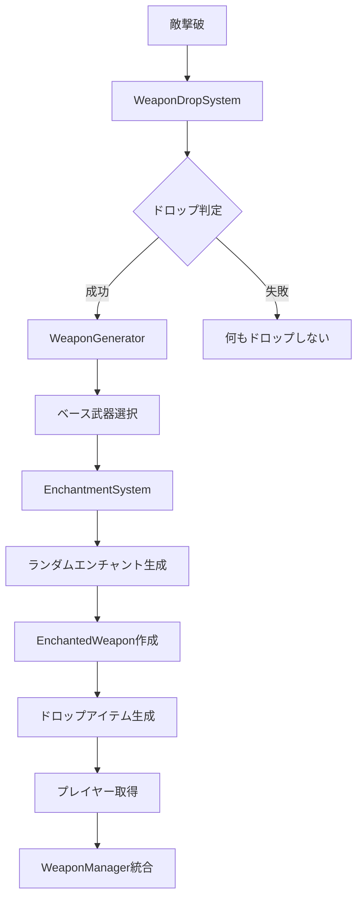
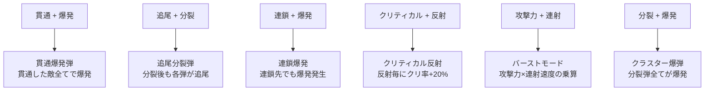

# 武器エンチャント＋ドロップシステム設計書

## 概要

現在の武器解除システムをランダムドロップシステムに変更し、各武器にランダムなエンチャントを0個以上付与するシステムを実装する。エンチャントの組み合わせによる「組み合わせ爆発」効果を重視し、予想外で面白い武器性能を実現する。

## システム全体アーキテクチャ



## エンチャントシステム設計

### エンチャントタイプ定義

```typescript
enum EnchantmentType {
  // 基本性能強化
  DAMAGE_BOOST = 'damage_boost',           // 攻撃力+N
  FIRE_RATE_BOOST = 'fire_rate_boost',     // 連続発射数+N
  BULLET_COUNT = 'bullet_count',           // 同時発射数+N
  PIERCING = 'piercing',                   // 貫通+N
  CRITICAL_HIT = 'critical_hit',           // クリティカルヒット率+N%
  
  // 特殊効果
  EXPLOSIVE_ROUNDS = 'explosive_rounds',    // 爆発弾
  HOMING_BULLETS = 'homing_bullets',       // 追尾弾
  CHAIN_LIGHTNING = 'chain_lightning',     // 連鎖攻撃
  FREEZE_EFFECT = 'freeze_effect',         // 凍結効果
  LIFE_STEAL = 'life_steal',               // ライフスティール
  
  // 組み合わせ爆発用
  MULTI_SPLIT = 'multi_split',             // 多段分裂
  RICOCHET = 'ricochet',                   // 反射弾
  ORBITAL_STRIKE = 'orbital_strike',       // 軌道爆撃
  TIME_DILATION = 'time_dilation',         // 時間減速
}
```

### 基本エンチャント効果

#### Tier 1: 基本強化系
```typescript
const BASIC_ENCHANTMENTS = {
  DAMAGE_BOOST: {
    name: '攻撃力強化',
    tiers: [10, 25, 50, 100, 200], // +10%, +25%, +50%, +100%, +200%
    stackable: true,
  },
  FIRE_RATE: {
    name: '連射速度',
    tiers: [15, 30, 50, 75, 100], // -15%, -30%, -50%, -75%, -100%
    stackable: true,
  },
  BULLET_COUNT: {
    name: '同時発射数',
    tiers: [1, 2, 3, 5, 8], // +1, +2, +3, +5, +8発
    stackable: true,
  },
  PIERCING: {
    name: '貫通',
    tiers: [1, 2, 4, 7, 12], // 1, 2, 4, 7, 12体貫通
    stackable: false,
  },
  CRITICAL_HIT: {
    name: 'クリティカル',
    tiers: [10, 20, 35, 55, 80], // 10%, 20%, 35%, 55%, 80%
    stackable: false,
  },
};
```

#### Tier 2: 特殊効果系
```typescript
const SPECIAL_ENCHANTMENTS = {
  EXPLOSIVE: {
    name: '爆発',
    effect: '着弾時に範囲爆発',
    tiers: [30, 50, 80, 120, 180], // 爆発半径
  },
  HOMING: {
    name: '追尾',
    effect: '最も近い敵を自動追尾',
    tiers: [2, 4, 6, 10, 15], // 追尾時間(秒)
  },
  CHAIN_LIGHTNING: {
    name: '連鎖',
    effect: '近くの敵に連鎖ダメージ',
    tiers: [2, 4, 6, 10, 15], // 連鎖回数
  },
  SPLIT_SHOT: {
    name: '分裂',
    effect: '一定時間後に複数弾に分裂',
    tiers: [2, 3, 5, 8, 12], // 分裂数
  },
  RICOCHET: {
    name: '反射',
    effect: '壁や敵で反射',
    tiers: [1, 2, 4, 7, 12], // 反射回数
  },
};
```

## 組み合わせ爆発効果システム

### 2つの組み合わせ効果



### 組み合わせ効果詳細

| 組み合わせ | 新効果名 | 説明 | 乗算倍率 |
|-----------|----------|------|----------|
| 貫通 + 爆発 | **貫通爆発弾** | 敵を貫通しながら各敵で爆発 | 2.0x |
| 追尾 + 分裂 | **追尾分裂弾** | 敵に向かって分裂弾が追尾 | 2.2x |
| 連鎖 + 凍結 | **凍結連鎖** | 連鎖した敵全てを凍結 | 1.8x |
| クリティカル + 反射 | **クリティカル反射** | 反射するたびにクリティカル率上昇 | 1.7x |
| 攻撃力 + 連射 | **バーストファイア** | 高威力連射モード | 1.5x |
| 分裂 + 爆発 | **クラスター爆弾** | 分裂後に全弾が爆発 | 2.5x |
| 追尾 + 連鎖 | **スマート連鎖** | 最適な敵を自動選択して連鎖 | 2.0x |
| 貫通 + 反射 | **ピンボール弾** | 貫通しながら壁で反射 | 1.9x |

### 3つの組み合わせ効果（超レア）

```typescript
const TRIPLE_COMBOS = {
  'PIERCING + EXPLOSIVE + CHAIN': {
    name: '貫通連鎖爆発',
    effect: '貫通→爆発→連鎖の順で発動',
    description: '敵を貫通し、各敵で爆発、爆発が連鎖する',
    multiplier: 3.0,
  },
  'HOMING + SPLIT + EXPLOSIVE': {
    name: '追尾クラスター',
    effect: '追尾→分裂→爆発の順で発動',
    description: '敵を追尾後分裂し、全弾が爆発',
    multiplier: 2.8,
  },
  'CRITICAL + RICOCHET + CHAIN': {
    name: 'クリティカル連鎖反射',
    effect: '反射毎にクリ率上昇、連鎖でクリ確定',
    description: '反射とクリティカルが相互強化',
    multiplier: 2.5,
  },
};
```

### レジェンダリー組み合わせ（4つ以上）

```typescript
const LEGENDARY_COMBOS = {
  'ULTIMATE_DESTROYER': {
    requirements: ['PIERCING', 'EXPLOSIVE', 'CHAIN', 'CRITICAL'],
    name: '究極破壊弾',
    effect: '全ての効果が最大レベルで発動',
    description: '貫通→爆発→連鎖→クリティカル確定',
    multiplier: 5.0,
    visualEffect: 'rainbow_trail',
  },
  'CHAOS_STORM': {
    requirements: ['HOMING', 'SPLIT', 'RICOCHET', 'EXPLOSIVE'],
    name: 'カオスストーム',
    effect: 'ランダムに全効果が発動',
    description: '予測不可能な弾道で大混乱',
    multiplier: 4.5,
    visualEffect: 'chaos_effect',
  },
};
```

## 武器ドロップシステム設計

### ドロップ確率設定

```typescript
const DROP_RATES = {
  [WeaponRarity.COMMON]: 0.15,      // 15%
  [WeaponRarity.UNCOMMON]: 0.08,    // 8%
  [WeaponRarity.RARE]: 0.04,        // 4%
  [WeaponRarity.EPIC]: 0.02,        // 2%
  [WeaponRarity.LEGENDARY]: 0.01,   // 1%
};

const ENCHANTMENT_COUNT_PROBABILITY = {
  0: 0.3,  // 30% - エンチャントなし
  1: 0.4,  // 40% - 1個
  2: 0.2,  // 20% - 2個
  3: 0.08, // 8% - 3個
  4: 0.02, // 2% - 4個
};
```

### エンチャント生成ルール

1. **武器レアリティ**がエンチャント数の上限を決定
2. **エンチャント数**は確率テーブルから決定
3. **エンチャントタイプ**はランダム選択（重複なし）
4. **エンチャントティア**は武器レアリティに応じて決定

## データ構造定義

### エンチャント済み武器

```typescript
interface EnchantedWeapon extends WeaponConfig {
  baseWeaponId: string;
  enchantments: Enchantment[];
  comboEffects: ComboEffect[];
  totalStats: EnhancedWeaponStats;
  displayName: string;
  uniqueId: string;
}

interface Enchantment {
  type: EnchantmentType;
  tier: number;        // 1-5のティア
  value: number;       // 効果値
  description: string;
}

interface ComboEffect {
  name: string;
  description: string;
  multiplier: number;
  visualEffect?: string;
  requirements: EnchantmentType[];
}
```

## 効果の乗算システム

### 乗算ルール

```typescript
const SYNERGY_MULTIPLIERS = {
  // 基本的な相性
  'DAMAGE + CRITICAL': 1.5,        // ダメージ×クリティカル
  'FIRE_RATE + BULLET_COUNT': 1.8, // 連射×多弾
  'PIERCING + EXPLOSIVE': 2.0,     // 貫通×爆発
  
  // 特殊な相性
  'HOMING + SPLIT': 2.2,           // 追尾×分裂
  'CHAIN + EXPLOSIVE': 2.5,        // 連鎖×爆発
  'RICOCHET + CRITICAL': 1.7,      // 反射×クリティカル
  
  // 三重組み合わせ
  'TRIPLE_COMBO': 3.0,             // 3つ組み合わせボーナス
  'LEGENDARY_COMBO': 5.0,          // 4つ以上組み合わせ
};
```

### バランス調整システム

```typescript
const BALANCE_SYSTEM = {
  // 組み合わせ数による調整
  comboCountMultiplier: {
    2: 1.0,   // 2つ組み合わせ：等倍
    3: 0.8,   // 3つ組み合わせ：0.8倍（強すぎ防止）
    4: 0.6,   // 4つ組み合わせ：0.6倍
    5: 0.4,   // 5つ組み合わせ：0.4倍
  },
  
  // レアリティによる調整
  rarityMultiplier: {
    [WeaponRarity.COMMON]: 1.0,
    [WeaponRarity.UNCOMMON]: 1.2,
    [WeaponRarity.RARE]: 1.5,
    [WeaponRarity.EPIC]: 2.0,
    [WeaponRarity.LEGENDARY]: 3.0,
  },
};
```

## 視覚効果システム

### 弾丸の見た目変化

```typescript
const VISUAL_COMBINATIONS = {
  'PIERCING + EXPLOSIVE': {
    bulletColor: '#FF6B35', // オレンジ
    trailEffect: 'fire',
    impactEffect: 'explosion_pierce',
  },
  'HOMING + SPLIT': {
    bulletColor: '#4ECDC4', // ターコイズ
    trailEffect: 'homing_split',
    impactEffect: 'split_homing',
  },
  'CHAIN + CRITICAL': {
    bulletColor: '#FFE66D', // 黄色
    trailEffect: 'lightning',
    impactEffect: 'critical_chain',
  },
};
```

## 実装が必要なクラス

### 新規クラス

1. **`WeaponDropSystem`** - 敵撃破時の武器ドロップ管理
2. **`EnchantmentSystem`** - エンチャント生成・適用
3. **`SynergyDetector`** - 組み合わせ効果検出
4. **`ComboEffectProcessor`** - 組み合わせ効果処理
5. **`WeaponGenerator`** - エンチャント済み武器生成
6. **`DroppedWeapon`** - ドロップされた武器エンティティ
7. **`EnchantmentEffectProcessor`** - エンチャント効果の計算・適用

### 既存システム拡張

- **`WeaponManager`** - エンチャント済み武器の管理機能追加
- **`PowerUp`** - 武器ドロップアイテムとしての拡張
- **敵撃破イベント** - ドロップシステムのトリガー
- **UI** - エンチャント情報の表示

## 実装フェーズ計画

### Phase 1: 基盤システム（1-2日）
1. エンチャントタイプ・データ構造定義
2. `EnchantmentSystem`基本実装
3. `SynergyDetector`基本実装
4. `WeaponGenerator`基本実装

### Phase 2: 組み合わせ爆発システム（2-3日）
1. `ComboEffectProcessor`実装
2. 各組み合わせ効果の実装
3. 効果の乗算・重複処理
4. バランス調整システム

### Phase 3: ドロップ・統合システム（2-3日）
1. `WeaponDropSystem`実装
2. `DroppedWeapon`エンティティ実装
3. `WeaponManager`統合
4. 敵撃破イベント統合

### Phase 4: UI・視覚効果（1-2日）
1. エンチャント情報UI
2. 視覚効果システム
3. 弾丸の見た目変化
4. 最終バランス調整

## 期待される効果

### ゲームプレイの改善
- **探索の楽しさ**: ランダムドロップによる発見の喜び
- **戦略性の向上**: エンチャント組み合わせによる戦術選択
- **リプレイ性**: 毎回異なる武器構成での挑戦
- **成長感**: より強力な組み合わせの発見

### 組み合わせ爆発の実現
- **予想外の効果**: 単純な足し算ではない乗算効果
- **発見の驚き**: 新しい組み合わせの発見
- **戦術の多様化**: 様々なプレイスタイルの実現
- **長期的な楽しさ**: 全組み合わせの探索

## 技術的考慮事項

### パフォーマンス
- エンチャント効果の計算最適化
- 弾丸プールの効率的な管理
- 視覚効果の描画最適化

### バランス
- 組み合わせ効果の適切な調整
- ゲーム進行の適切な難易度カーブ
- プレイヤーの選択肢の多様性確保

### 拡張性
- 新しいエンチャントの追加容易性
- 組み合わせ効果の柔軟な定義
- UI表示の拡張性

---

**作成日**: 2025/6/21  
**バージョン**: 1.0  
**ステータス**: 設計完了・実装準備中