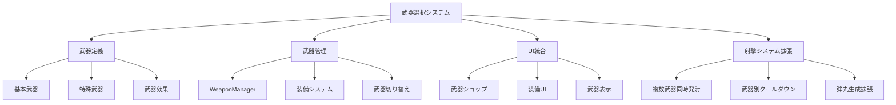

# 武器選択システム設計仕様書

## 概要

アップグレードショップで武器を購入・装備し、複数の武器を同時に使用できる武器選択システムの設計仕様書です。

## システム構成



## 1. 武器定義システム

### 1.1 武器タイプ

```typescript
enum WeaponType {
  BASIC_LASER = 'basic_laser',           // 基本レーザー
  PLASMA_CANNON = 'plasma_cannon',       // プラズマキャノン
  MISSILE_LAUNCHER = 'missile_launcher', // ミサイルランチャー
  ENERGY_BEAM = 'energy_beam',           // エネルギービーム
  EXPLOSIVE_ROUNDS = 'explosive_rounds', // 爆発弾
  HOMING_MISSILES = 'homing_missiles',   // 追尾ミサイル
  SPLIT_SHOT = 'split_shot',             // 分裂弾
  RAPID_FIRE = 'rapid_fire'              // 速射砲
}
```

### 1.2 武器設定インターフェース

```typescript
interface WeaponConfig {
  id: string;                    // 武器ID
  name: string;                  // 表示名
  description: string;           // 説明文
  type: WeaponType;             // 武器タイプ
  damage: number;               // 基本ダメージ
  fireRate: number;             // 発射間隔（ミリ秒）
  bulletSpeed: number;          // 弾丸速度
  bulletCount: number;          // 同時発射数
  spreadAngle?: number;         // 拡散角度（ラジアン）
  specialEffect?: WeaponSpecialEffect; // 特殊効果
  unlockCondition: (profile: PlayerProfile) => boolean; // 解除条件
  cost: number;                 // 購入コスト
  maxLevel: number;             // 最大レベル
  icon: string;                 // アイコン
  rarity: WeaponRarity;         // レアリティ
}
```

### 1.3 武器特殊効果

```typescript
interface WeaponSpecialEffect {
  type: 'explosive' | 'homing' | 'split' | 'piercing' | 'freeze';
  parameters: {
    explosionRadius?: number;
    homingDuration?: number;
    splitCount?: number;
    pierceCount?: number;
    freezeDuration?: number;
  };
}

enum WeaponRarity {
  COMMON = 'common',       // 一般
  UNCOMMON = 'uncommon',   // 珍しい
  RARE = 'rare',           // レア
  EPIC = 'epic',           // エピック
  LEGENDARY = 'legendary'  // レジェンダリー
}
```

## 2. 武器データ定義

### 2.1 基本武器

| 武器名 | タイプ | ダメージ | 発射間隔 | 解除条件 | コスト |
|--------|--------|----------|----------|----------|--------|
| ベーシックレーザー | BASIC_LASER | 1 | 200ms | 初期 | 0 |
| プラズマキャノン | PLASMA_CANNON | 2 | 300ms | レベル3 | 500 |
| ミサイルランチャー | MISSILE_LAUNCHER | 3 | 500ms | レベル5 | 1000 |

### 2.2 特殊武器

| 武器名 | タイプ | 特殊効果 | 解除条件 | コスト |
|--------|--------|----------|----------|--------|
| 爆発弾砲 | EXPLOSIVE_ROUNDS | 爆発 | 敵100体撃破 | 1500 |
| 追尾ミサイル | HOMING_MISSILES | 追尾 | ボス3体撃破 | 2000 |
| 分裂弾砲 | SPLIT_SHOT | 分裂 | ウェーブ10到達 | 2500 |

## 3. 武器管理システム

### 3.1 WeaponManager クラス

```typescript
class WeaponManager {
  private equippedWeapons: Map<string, EquippedWeapon>;
  private availableWeapons: WeaponConfig[];
  private maxEquippedWeapons: number = 3;
  private weaponCooldowns: Map<string, number>;
  
  // 武器装備
  equipWeapon(weaponId: string): boolean;
  
  // 武器取り外し
  unequipWeapon(weaponId: string): boolean;
  
  // 装備中武器取得
  getEquippedWeapons(): EquippedWeapon[];
  
  // 射撃実行
  fireWeapons(player: Player, deltaTime: number): Bullet[];
  
  // 武器アップグレード
  upgradeWeapon(weaponId: string): boolean;
  
  // クールダウン管理
  updateCooldowns(deltaTime: number): void;
}
```

### 3.2 装備武器インターフェース

```typescript
interface EquippedWeapon {
  weaponId: string;
  config: WeaponConfig;
  level: number;
  lastFireTime: number;
  slot: number; // 装備スロット（0-2）
}
```

## 4. UI統合

### 4.1 武器ショップ拡張

既存の `UpgradeShop.tsx` を拡張して武器カテゴリを追加：

```typescript
// 新しいカテゴリ追加
type UpgradeCategory = 'weapon' | 'defense' | 'utility' | 'weapons';

// 武器専用コンポーネント
const WeaponShopSection: React.FC<{
  availableWeapons: WeaponConfig[];
  equippedWeapons: EquippedWeapon[];
  onPurchase: (weaponId: string) => void;
  onEquip: (weaponId: string) => void;
  onUnequip: (weaponId: string) => void;
}>;
```

### 4.2 ゲーム内武器UI

```typescript
// 装備武器表示コンポーネント
const EquippedWeaponsDisplay: React.FC<{
  equippedWeapons: EquippedWeapon[];
  cooldowns: Map<string, number>;
}>;

// 武器切り替えボタン（モバイル用）
const WeaponSwitchButton: React.FC<{
  weapons: EquippedWeapon[];
  currentWeapon: number;
  onSwitch: (weaponIndex: number) => void;
}>;
```

## 5. 射撃システム拡張

### 5.1 Player クラス統合

```typescript
// Player クラスに追加するメソッド
class Player {
  private weaponManager: WeaponManager;
  
  // 武器システムで射撃
  public shootWithWeapons(): void;
  
  // 武器管理システム取得
  public getWeaponManager(): WeaponManager;
  
  // 特定武器で射撃
  public shootWithWeapon(weaponId: string): void;
}
```

### 5.2 弾丸生成拡張

```typescript
// 武器タイプ別弾丸ファクトリー
class WeaponBulletFactory {
  static createBullet(
    weaponConfig: WeaponConfig,
    x: number,
    y: number
  ): Bullet | AdvancedBullet;
  
  static createExplosiveBullet(config: WeaponConfig, x: number, y: number): ExplosiveBullet;
  static createHomingBullet(config: WeaponConfig, x: number, y: number): HomingBullet;
  static createSplitBullet(config: WeaponConfig, x: number, y: number): SplitBullet;
}
```

## 6. 実装フェーズ

### Phase 1: 基盤システム構築 ✅ 開始予定
1. **武器定義システム**
   - `src/weapons/types/WeaponTypes.ts` - 武器タイプ定義
   - `src/weapons/data/weaponConfigs.ts` - 武器設定データ
   - `src/weapons/interfaces/IWeapon.ts` - 武器インターフェース

2. **武器管理システム**
   - `src/weapons/managers/WeaponManager.ts` - 武器管理クラス
   - `src/weapons/entities/Weapon.ts` - 武器エンティティ
   - `src/weapons/services/WeaponEffectService.ts` - 武器効果サービス

### Phase 2: プレイヤーシステム統合
1. **Player クラス拡張**
   - 武器管理システムとの統合
   - 複数武器同時射撃機能
   - 武器別クールダウン管理

2. **射撃システム拡張**
   - 武器タイプ別弾丸生成
   - 特殊効果適用
   - パフォーマンス最適化

### Phase 3: UI統合
1. **武器ショップ拡張**
   - 既存UpgradeShopに武器カテゴリ追加
   - 武器購入・装備UI
   - 武器プレビュー機能

2. **ゲーム内UI**
   - 装備武器表示
   - 武器切り替えUI（モバイル対応）
   - 武器クールダウン表示

### Phase 4: バランス調整・最適化
1. **ゲームバランス**
   - 武器威力・コスト調整
   - 解除条件設定
   - 難易度バランス

2. **パフォーマンス最適化**
   - 弾丸プール拡張
   - 描画最適化
   - メモリ使用量最適化

## 7. 技術的考慮事項

### 7.1 既存システムとの統合
- **アップグレードシステム**: 武器を新しいアップグレードカテゴリとして追加
- **弾丸システム**: 既存の特殊弾丸クラス（ExplosiveBullet, HomingBullet, SplitBullet）を活用
- **UI システム**: 既存のReactコンポーネントを拡張

### 7.2 パフォーマンス対策
- **オブジェクトプール**: 武器別弾丸プール管理
- **描画最適化**: LODシステムとの統合
- **メモリ管理**: 武器エフェクトの効率的管理

### 7.3 モバイル対応
- **タッチUI**: 武器切り替えボタン
- **ジョイスティック統合**: 武器選択機能
- **パフォーマンス**: モバイル向け最適化

## 8. ファイル構造

```
src/weapons/
├── types/
│   ├── WeaponTypes.ts          # 武器タイプ定義
│   └── index.ts
├── interfaces/
│   ├── IWeapon.ts              # 武器インターフェース
│   ├── IWeaponManager.ts       # 武器管理インターフェース
│   └── index.ts
├── data/
│   ├── weaponConfigs.ts        # 武器設定データ
│   ├── weaponCategories.ts     # 武器カテゴリ定義
│   └── index.ts
├── entities/
│   ├── Weapon.ts               # 武器エンティティ
│   ├── EquippedWeapon.ts       # 装備武器クラス
│   └── index.ts
├── managers/
│   ├── WeaponManager.ts        # 武器管理システム
│   ├── WeaponUpgradeManager.ts # 武器アップグレード管理
│   └── index.ts
├── services/
│   ├── WeaponEffectService.ts  # 武器効果サービス
│   ├── WeaponBulletFactory.ts  # 武器弾丸ファクトリー
│   └── index.ts
└── index.ts
```

## 9. 次のステップ

1. **武器タイプ定義の作成** - `src/weapons/types/WeaponTypes.ts`
2. **武器インターフェースの定義** - `src/weapons/interfaces/IWeapon.ts`
3. **武器設定データの作成** - `src/weapons/data/weaponConfigs.ts`
4. **WeaponManagerの基本実装**
5. **既存システムとの統合テスト**

---

**作成日**: 2025/6/20  
**バージョン**: 1.0  
**ステータス**: Phase 1 開始準備完了